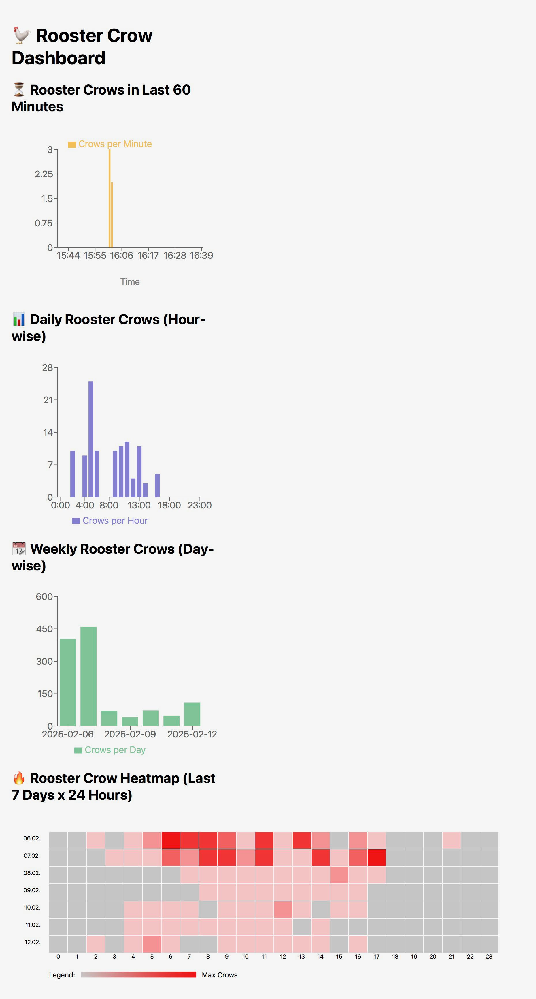

# RoosterRecorder

## Overview

A Raspberry Pi project to classify and track dedicated sound events - using a rooster crow as an example

This is a toy project which has the following goals:
* create a Raspberry Pi based device which automatically monitors, classifies and tracks dedicated sound events based on a lightweight AI approach
* on a Raspberry Pi how to
  * enable audio input and automated, tiggered recording
  * install a lightweight AI infrastructure
  * train and use AI
  * store relevant results in a database
  * perform appealing ways to output the results, easily accessible via a web page
* on a metalevel, play with GPT4 etc. to see whether programming can be accelerated
  * the answer is: massivley, to an almost frightening extend
# TL;DR

At the end we do have a Raspberry Pi running the  scripts given in the next section. All of them are in the repository in the src directory. 
If everything works, then opening a browser and typing (substitute raspberyypi with your respective network name or IP address)
```bash
http://raspberrypi:3000/
```
shows you this dashboard:



## Overview of All Scripts
Here is a brief explanation of all key scripts used in this project. 
Caveat: without understanding what you do just copying them to a Raspberry Pi will not work. You have to 

### **Audio Processing & Classification**
- **`test_audio_device.py`**: Tests the available audio hardware.
- **`trigger_audio_capture.py`**: Records sound snippets above a certain threshold and saves them in `recorded_events/`. These `.wav` files are later copied to a Mac for manual sorting.
- **`sort_recordings_mac_variable_speed.py`**: Runs on a Mac to help sort sound snippets into `noise/` and `rooster/` directories. The `-speed` flag adjusts the playback speed for faster sorting. The sorted files are then copied back to the Raspberry Pi.
- **`extract_features.py`**: Extracts features from the audio samples in `noise/` and `rooster/`, creating a `features.csv` file.
- **`train_classifier.py`**: Trains an AI model using `features.csv` and outputs `rooster_classifier.pkl`.
- **`ai_audio_classifier.py`**: Uses the trained model to classify new events, storing them in `classification_events.db` and saving `.wav` files in `rooster_ai_classified/` and `noise_ai_classified/` (if the `-r` and/or `-n` flags are set).

### **Dashboard & Visualization**
- **`dashboard_backend.py`**: Flask service that serves data for visualization in the browser.
- **`App.js`**: The React component that connects the frontend to the Flask API. Located in `rooster-dashboard/src/`.

## 🛠 Required Python Libraries

Install all necessary Python libraries using:

```bash
pip install sounddevice scipy numpy librosa sklearn flask flask-cors sqlite3 argparse pickle
```


### 📌 **Breakdown by Functionality**

| Library        | Purpose |
|---------------|---------|
| `sounddevice` | Audio recording and playback |
| `scipy`       | Audio file handling (`wav.write()`) |
| `numpy`       | Audio processing, buffer handling |
| `librosa`     | Audio feature extraction (MFCCs) |
| `sklearn`     | Machine learning (RandomForestClassifier) |
| `flask`       | API backend to serve the React dashboard |
| `flask-cors`  | Allow cross-origin requests (for React frontend) |
| `sqlite3`     | Store classified events in a database |
| `argparse`    | Handle command-line arguments (`-r`, `-n` flags) |
| `pickle`      | Save and load the trained AI model |

---

## 🔧 System Dependencies

Ensure the following **system packages** are installed:

### **For Audio Recording & Processing**
```bash
sudo apt install portaudio19-dev pulseaudio alsa-utils
```
| Package            | Purpose |
|--------------------|---------|
| `portaudio19-dev` | Required for `sounddevice` to work |
| `pulseaudio`      | Manages sound input/output |
| `alsa-utils`      | Provides `arecord -L` for listing sound devices |

---

### **For Flask API & React Dashboard**
```bash
sudo apt install python3-venv nodejs npm
```
| Package        | Purpose |
|---------------|---------|
| `python3-venv` | Virtual environment support |
| `nodejs` & `npm` | Required for React dashboard |

---

## 📌 Additional Setup

After installing the dependencies, **activate the virtual environment** before running any scripts:

```bash
source ~/programming/myenv/bin/activate
```

Then run the Flask API or AI classifier.

---

## ✅ Summary

- **Python Libraries** → Install via `pip install -r requirements.txt`
- **System Dependencies** → Install via `apt install`
- **Virtual Environment** → Always activate before running scripts


## HW selection and OS installation
### HW
I decided to go for a Raspberry 5 with 8GB RAM without a dedicated HW accelerator for AI. I want to understand what level of "AI might" is possible with 
* a 4GHz Quad-Core 64-bit Arm Cortex-A76 CPU
* a VideoCore VII GPU
* and 8GB LPDDR4X-4267 SDRAM

In addition we need a microphone. I went with the cheapest USB microphone I could get. Which was called "Yosoo Helath Gear USB MINI microphone" and is barely more than the USB 2.0 connector plus a half-circle shaped piece of plastic. 
This is how it looks like:


### SW installation
I installed a plain Raspberry Pi OS with desktop. Desktop just in case, I completely went headleass. 
I will not decribe this in detail, I just used the official Raspberry Pi Imager (https://www.raspberrypi.com/software/). 
Hint: before flashing the SD card use the possibility of OS customizaiton in the Imager to set SSH login, Wifi password, time zone etc. Then just insert the flashed SD card, plug in the power and let the OS do the magic. 
After a while you can login via SSH and the login data you have given before.

Then the usual hygiene steps: 
```php
sudo apt update
sudo apt full-upgrade
```
Wen need Python 3, which should be preinstalled, but just to be sure
```php
sudo apt install python3 python3-pip -y
```
### First steps with audio
First I create my playground directory. 
```php
mkdir programming
cd programming/
 ```
#### Install Audio Recording Tools

    Install ALSA Utilities (for handling audio devices):
```php
sudo apt install alsa-utils -y
```
Plug in the microphone in one of the USB ports. Now test by listing the available audio devices:
```php
arecord -l
```
In my case I got the folliwing response
```php
**** List of CAPTURE Hardware Devices ****
card 2: Device [USB PnP Sound Device], device 0: USB Audio [USB Audio]
  Subdevices: 1/1
  Subdevice #0: subdevice #0
```
To check if the microphone is working, record a short test audio file:
```php
arecord -D plughw:2,0 -f cd -t wav -d 5 test.wav
```
To explain the magic options: 
* -D plughw:2,0 → Specifies card 2, device 0 as the recording source.
* -f cd → Records in 16-bit, 44.1 kHz stereo format.
* -t wav → Saves as a WAV file.
* -d 5 → Records for 5 seconds.
* test.wav → Output filename.
Test the microphone:
```php
arecord -D plughw:1,0 -f cd test.wav
aplay test.wav
```
When there was just silence I realized that there the RaspPi does not have a buid-in speaker :-)
Fortunately, I had an old Jabra USB speaker in my dusty electronics leftover drawer. I plugged it in and without any further setting ajustment the "aplay" gave me sound. Yeah!

If you want the USB microphone to be the default input device, create or edit the ~/.asoundrc file:

```php
nano ~/.asoundrc
```
Add the following:

```php
pcm.!default {
    type hw
    card 2
    device 0
}
 
ctl.!default {
    type hw
    card 2
}
```
Save and exit (CTRL + X, then Y, then Enter).

Then, restart ALSA:

```php
sudo systemctl restart alsa-restore
```
Test again with:

```php
arecord -d 5 -f cd newtest.wav && aplay newtest.wav
```

So (hopefully) we have now a working audio setting!

## Audio Capturing

The next packages need to be installed: I tried without but using a vitual environment was finally the only way to get everything running.

### new virtual environment
Step 1: Create and Activate the Virtual Environment

    Navigate to your project directory (or home directory):

cd ~/  # Or your preferred working directory

Create a virtual environment (if not already created):

python3 -m venv myenv

Activate the virtual environment:

    source myenv/bin/activate

Your terminal should now show (myenv) at the beginning of the prompt, indicating that the virtual environment is active.
Step 2: Install sounddevice and Dependencies

    Ensure pip is up to date inside the virtual environment:

pip install --upgrade pip

Install sounddevice and necessary dependencies:

    pip install sounddevice numpy scipy

Step 3: Verify Installation

    Check if sounddevice is available:

python -c 'import sounddevice; print("Sounddevice is installed and working!")'

## Recording triggered audio

Now our first Python script. 
Copy and paste the Python code below into a file:

```php
nano trigger_audio_capture.py
```
* Press CTRL + X.
* Press Y to confirm saving.
* Press Enter to save and exit.

Here is the script
```python
import sounddevice as sd
import numpy as np
import scipy.io.wavfile as wav
import time as time_module  # Renamed to avoid conflict with datetime
import os
from datetime import datetime

# Configuration
SAMPLE_RATE = 16000               # Sampling rate in Hz
DURATION_PRE_TRIGGER = 0.5        # Seconds before trigger to keep (ring buffer)
DURATION_POST_TRIGGER = 3.5       # Seconds after trigger to record
THRESHOLD = 0.1                   # Adjust based on microphone sensitivity
COOLDOWN_PERIOD = 2               # Seconds to wait after recording completes
OUTPUT_DIR = "recorded_events"    # Folder to store audio files

# Ensure the output directory exists
os.makedirs(OUTPUT_DIR, exist_ok=True)

# Number of samples for the pre-trigger portion
pre_trigger_samples = int(SAMPLE_RATE * DURATION_PRE_TRIGGER)
# Initialize ring buffer with zeros.
ring_buffer = np.zeros(pre_trigger_samples, dtype='float32')

# Use next_allowed_trigger_time to enforce a full cooldown period
next_allowed_trigger_time = 0

def apply_fade_in(audio, fade_duration, sample_rate):
    """
    Apply a fade-in effect to the beginning of the audio.
    This smooths out any abrupt transitions.
    """
    fade_samples = int(fade_duration * sample_rate)
    fade_samples = min(fade_samples, len(audio))
    fade_curve = np.linspace(0, 1, fade_samples)
    audio[:fade_samples] *= fade_curve
    return audio

def apply_fade_out(audio, fade_duration, sample_rate):
    """
    Apply a fade-out effect to the end of the audio.
    """
    fade_samples = int(fade_duration * sample_rate)
    fade_samples = min(fade_samples, len(audio))
    fade_curve = np.linspace(1, 0, fade_samples)
    audio[-fade_samples:] *= fade_curve
    return audio

def audio_callback(indata, frames, time_info, status):
    """
    Process incoming audio. When a loud sound is detected and the cooldown
    period has passed, record an event consisting of 0.5 sec pre-trigger and
    3.5 sec post-trigger audio.
    """
    global ring_buffer, next_allowed_trigger_time

    if status:
        print(f"Audio status error: {status}")

    # Get the current audio chunk (first channel)
    audio_chunk = indata[:, 0]
    current_time = time_module.time()

    # Only trigger if the threshold is exceeded and we are past the cooldown
    if np.max(np.abs(audio_chunk)) > THRESHOLD and current_time >= next_allowed_trigger_time:
        # Identify the first sample index that exceeds the threshold.
        trigger_indices = np.where(np.abs(audio_chunk) > THRESHOLD)[0]
        trigger_index = trigger_indices[0] if trigger_indices.size > 0 else 0

        print("Trigger detected! Recording event...")

        # --- Prepare the Pre-Trigger Audio ---
        # The ring buffer holds the previous 0.5 sec of audio.
        # Also include any audio from the current chunk before the trigger.
        pre_trigger_candidate = np.concatenate((ring_buffer, audio_chunk[:trigger_index]))
        pre_trigger_audio = pre_trigger_candidate[-pre_trigger_samples:]
        # Apply a short fade-out to smooth the end of the pre-trigger audio.
        pre_trigger_audio = apply_fade_out(pre_trigger_audio, fade_duration=0.02, sample_rate=SAMPLE_RATE)

        # --- Prepare the Post-Trigger Audio ---
        # Use the part of the current chunk starting from the trigger.
        post_trigger_initial = audio_chunk[trigger_index:]
        initial_length = len(post_trigger_initial)
        total_post_trigger_samples = int(SAMPLE_RATE * DURATION_POST_TRIGGER)
        remaining_samples = total_post_trigger_samples - initial_length

        if remaining_samples > 0:
            # Record additional audio to complete the post-trigger segment.
            post_trigger_remaining = sd.rec(remaining_samples,
                                            samplerate=SAMPLE_RATE,
                                            channels=1,
                                            dtype='float32')
            sd.wait()  # Wait for recording to finish.
            post_trigger_remaining = post_trigger_remaining.flatten()
        else:
            post_trigger_remaining = np.array([], dtype='float32')

        # Concatenate the immediate post-trigger audio with the extra recorded part.
        post_trigger_audio = np.concatenate((post_trigger_initial, post_trigger_remaining))
        # Apply a short fade-in to smooth the beginning of the post-trigger audio.
        post_trigger_audio = apply_fade_in(post_trigger_audio, fade_duration=0.02, sample_rate=SAMPLE_RATE)

        # --- Combine and Save ---
        # Final recording is 0.5 sec pre-trigger plus 3.5 sec post-trigger.
        combined_audio = np.concatenate((pre_trigger_audio, post_trigger_audio))
        timestamp = datetime.now().strftime("%Y%m%d-%H%M%S")
        filename = os.path.join(OUTPUT_DIR, f"event_{timestamp}.wav")
        # Convert audio to 16-bit PCM format.
        wav.write(filename, SAMPLE_RATE, (combined_audio * 32767).astype(np.int16))
        print(f"Saved: {filename}")

        # --- Update the Ring Buffer ---
        # Use the tail end of the post-trigger audio for future pre-trigger context.
        if len(post_trigger_audio) >= pre_trigger_samples:
            ring_buffer = post_trigger_audio[-pre_trigger_samples:]
        else:
            ring_buffer = post_trigger_audio.copy()

        # --- Update the Cooldown Timer ---
        # Now that recording is complete, disallow new triggers for the cooldown period.
        next_allowed_trigger_time = time_module.time() + COOLDOWN_PERIOD

        # Exit early so that the ring buffer update below does not override our settings.
        return

    # --- Normal Operation: Update the Ring Buffer ---
    # Always keep the ring buffer containing the last 0.5 sec of audio.
    ring_buffer = np.roll(ring_buffer, -len(audio_chunk))
    ring_buffer[-len(audio_chunk):] = audio_chunk

# --- Main Program: Start Listening ---
print("Listening for sound triggers...")
with sd.InputStream(samplerate=SAMPLE_RATE, channels=1, callback=audio_callback):
    while True:
        time_module.sleep(0.1)  # Keep the script running

```
Some explanations of the script:
### Script Overview

* Continuous Audio Monitoring:
  * The script uses the sounddevice library to continuously capture audio at 16 kHz via a callback function.
* Pre-Trigger Ring Buffer:
  * A ring buffer maintains the last 0.5 seconds of audio. This allows the script to include audio preceding the trigger event.
* Trigger Detection:
  * The script monitors incoming audio and detects a trigger when any sample exceeds a set threshold (THRESHOLD = 0.2).
* Recording Sequence:
  * Pre-Trigger Audio:
    * When a trigger is detected, the script retrieves the last 0.5 seconds of audio from the ring buffer, ensuring that the sound immediately before the trigger is captured.
  * Post-Trigger Audio:
    * It then captures the remainder of the current audio chunk starting from the trigger and records additional audio (if needed) to complete 3.5 seconds of post-trigger audio.
  * Smoothing Transitions:
    * A short fade-out is applied to the end of the pre-trigger audio and a fade-in is applied to the beginning of the post-trigger audio to smooth any abrupt transitions.
  * File Saving:
    * The final combined 4-second audio (0.5 sec pre-trigger + 3.5 sec post-trigger) is saved as a WAV file (converted to 16-bit PCM) in the recorded_events directory with a timestamped filename.
* Ring Buffer Maintenance:
  * After each trigger event, the ring buffer is updated with the tail end of the post-trigger recording to maintain accurate pre-trigger context for future events.

### Handling the Cooldown Period
* Initial Problem:
  * Originally, the cooldown period was based on the trigger time, which meant that subsequent recordings could be inadvertently triggered too soon—sometimes even when the sound level was below the threshold—because the cooldown wasn't tied to the completion of the full recording.
* Implemented Solution:
  * A new variable, next_allowed_trigger_time, is introduced.
  * Cooldown Enforcement:
    * When a trigger is processed, the script records the post-trigger audio and only after saving the file does it update next_allowed_trigger_time to the current time plus the cooldown period (2 seconds).
  * Effect:
     * This approach ensures that no new trigger will be accepted until at least 2 seconds after the 3.5-second post-trigger recording is complete, effectively spacing out recording events by approximately 5.5 seconds (trigger + 3.5 sec recording + 2 sec cooldown).
  * Outcome:
    * The updated cooldown mechanism reliably prevents overlapping or spurious triggers, ensuring that each recording is an isolated event.

By the way, this explanation was created by ChatGPT 03-mini-high.

Create the directory for the sound files
```php
mkdir recorded_events
```

And now, keep your fingers crossed, let's run the python script.
Make sure that your virtual environment ist active. The console should start with "(myenv)...".
```php 
python trigger_audio_capture.py
```

If everything goes as planned, for every sound event you get a set of time stamped .wav file in the directory recorded_event. If not then here are some fine-tuning suggestions
* Too sensitive? Increase THRESHOLD (e.g., 0.15 or 0.2).
* Not sensitive enough? Decrease THRESHOLD (e.g., 0.05).
* Too many recordings? Increase COOLDOWN_PERIOD (e.g., 3 or 4 seconds).
* Misses sounds? Increase DURATION_PRE_TRIGGER (e.g., 0.7 sec).If nothing happens then you need to decrease the THRESHOLD value. And if you get too many events, increase the THRESHOLD value. 

We have created a trigger-based sound event recorder. 

So far so good. 

## Entering the AI world

Now it is getting even more exciting. We will now create an AI-based rooster sound classification.

First, the required libiraries. Again, ensure that the virtual environment ist still active.

```php
pip install --extra-index-url https://google-coral.github.io/py-repo/ tflite-runtime
```
* This downloads the latest compatible TensorFlow Lite runtime for Raspberry Pi.
* The --extra-index-url ensures that the correct Raspberry Pi-specific package is retrieved.

Now install the remaining AI packages
```php
pip install numpy librosa soundfile
```
Verify the installation
```php
python -c 'import numpy, librosa, tflite_runtime.interpreter; print("AI libraries installed and working!")'
```
If no errors appear, the installation is successful! 🚀

### Data preparation

No (classical) AI without training data. So let's create samples to be classified. 
First, put the Raspberry Pi with the microphone at the "crime scene", i.e., close to the area where the sound events happen. Then trigger our recording script. You may have to fine tune again the trigger conditions as described before. 
In my case I am lucky as I can put the Raspberry Pi in my garden but still within reach of my Wifi network. So I can make the adjustments out of my cosy office :-)

Let it run such than you get ideally more than 50 recordings eache, e.g., rooster crows vs. car sounds etc. These recordings are then stored in our diretory 'recorded_event'.

Now we have to classify them manually. Means: using a helping python script.

But first we have to identify the correct audio output device.
Execute 
```python
python -c "import sounddevice as sd; print(sd.query_devices())"
```
You will get an output like

```php
0 USB PnP Sound Device: Audio (hw:2,0), ALSA (1 in, 0 out)
  1 Jabra SPEAK 510 USB: Audio (hw:3,0), ALSA (1 in, 2 out)
  2 pulse, ALSA (32 in, 32 out)
* 3 default, ALSA (32 in, 32 out)
```

In my case Device 1 is the right one.

Create following python script, named 'sort_recordings.py'.
```python
import os
import shutil
import sounddevice as sd
import soundfile as sf

# Define directories
RECORDED_DIR = "recorded_events"
OUTPUT_DIR = "dataset"
ROOSTER_DIR = os.path.join(OUTPUT_DIR, "rooster")
NOISE_DIR = os.path.join(OUTPUT_DIR, "noise")

# Ensure output directories exist
os.makedirs(ROOSTER_DIR, exist_ok=True)
os.makedirs(NOISE_DIR, exist_ok=True)

# Get a list of all .wav files in recorded_events
wav_files = sorted([f for f in os.listdir(RECORDED_DIR) if f.endswith(".wav")])

def play_audio(file_path):
    """Plays a given .wav file."""
    data, samplerate = sf.read(file_path)
    sd.play(data, samplerate)
    sd.wait()  # Wait until playback is finished

print("Audio classification started.")
print("Press 'r' to label as rooster, 'n' for noise, or 'q' to quit.")

for filename in wav_files:
    file_path = os.path.join(RECORDED_DIR, filename)
    
    print(f"\nPlaying: {filename}")
    play_audio(file_path)

    while True:
        command = input("Enter classification (r=rooster, n=noise, q=quit): ").strip().lower()
        
        if command == 'r':
            shutil.move(file_path, os.path.join(ROOSTER_DIR, filename))
            print(f"Moved to: {ROOSTER_DIR}")
            break
        elif command == 'n':
            shutil.move(file_path, os.path.join(NOISE_DIR, filename))
            print(f"Moved to: {NOISE_DIR}")
            break
        elif command == 'q':
            print("Exiting classification.")
            exit()
        else:
            print("Invalid input. Use 'r' for rooster, 'n' for noise, or 'q' to quit.")

print("All recordings sorted! 🎉")
```
Before running the script, create two directories:
```php
mkdir rooster
mkdir noise
```
HINT: This script did not work for me as my audio device (Jabra SPEAK 510 USB) forced a 48kHz playback, so every .wav file was played at 4x speed. Therefore, I had to add an upsampling step in the script. 

Here is my alternative, which did it for me. So you may have to tinker a bit with the script, depending on your audio settings

```python
import os
import shutil
import sounddevice as sd
import soundfile as sf
import numpy as np

# Define directories
RECORDED_DIR = "recorded_events"
ROOSTER_DIR = "rooster"
NOISE_DIR = "noise"

# Ensure output directories exist
os.makedirs(ROOSTER_DIR, exist_ok=True)
os.makedirs(NOISE_DIR, exist_ok=True)

# Set Jabra as the output device
sd.default.device = 1  # Jabra SPEAK 510 USB

def play_audio(file_path):
    """Plays a .wav file, resampling to 48 kHz if needed."""
    try:
        data, samplerate = sf.read(file_path)

        # Jabra forces 48 kHz playback, so resample if needed
        target_rate = 48000
        if samplerate != target_rate:
            print(f"Resampling from {samplerate} Hz → {target_rate} Hz for Jabra")
            data = np.interp(
                np.linspace(0, len(data), int(len(data) * target_rate / samplerate)),
                np.arange(len(data)),
                data
            )

        print(f"Playing {file_path} at {target_rate} Hz")
        sd.play(data, samplerate=target_rate)
        sd.wait()
    except Exception as e:
        print(f"Error playing audio: {e}")

print("\n🔊 Audio classification started.")
print("Press 'r' to label as rooster, 'n' for noise, or 'q' to quit.")

for filename in sorted(os.listdir(RECORDED_DIR)):
    if filename.endswith(".wav"):
        file_path = os.path.join(RECORDED_DIR, filename)

        print(f"\n🎵 Playing: {filename}")
        play_audio(file_path)

        while True:
            command = input("Enter classification (r=rooster, n=noise, q=quit): ").strip().lower()
            if command == 'r':
                shutil.move(file_path, os.path.join(ROOSTER_DIR, filename))
                print(f"✅ Moved to: {ROOSTER_DIR}")
                break
            elif command == 'n':
                shutil.move(file_path, os.path.join(NOISE_DIR, filename))
                print(f"✅ Moved to: {NOISE_DIR}")
                break
            elif command == 'q':
                print("🚪 Exiting classification.")
                exit()
            else:
                print("❌ Invalid input. Use 'r' for rooster, 'n' for noise, or 'q' to quit.")

print("🎉 All recordings sorted successfully!")
```
1. Run the  python script:
```python
python sort_recordings.py
```
2. Listen to each recording:

* The script will play each .wav file in recorded_events/.

3. Manually classify:
* Press r → Moves the file to dataset/rooster/.
* Press n → Moves the file to dataset/noise/.
* Press q → Quits the script. Ideally, you do not need to press q as the script will end automatically once all .wav files are classified

Repeat until all files are classified.

### Alternative: Manual file classification on a Mac

The above approch assumes, that we run the Python script on the RaspPi. However - at least in my case - the RasPi sits in my garden shed, and currenty it is -5 degrees Celsius outside.

So my alternative was 
* to copy the directory recorded_events on my Mac (via Samba, see "Helpful Hint" section below)
*  to run the Python script on my Mac, filling directory rooster and noise
*  copy the sorted .wav files back into the respective directories on the RasPi

This requires a slight modification of the script, which I created on my Mac and called sort_recordings_mac.py: 

```python
import sounddevice as sd
import numpy as np
import scipy.io.wavfile as wav
import time as time_module  # Renamed to avoid conflict with datetime
import os
from datetime import datetime

# Configuration
SAMPLE_RATE = 16000               # Sampling rate in Hz
DURATION_PRE_TRIGGER = 0.5        # Seconds before trigger to keep (ring buffer)
DURATION_POST_TRIGGER = 3.5       # Seconds after trigger to record
THRESHOLD = 0.1                   # Adjust based on microphone sensitivity
COOLDOWN_PERIOD = 2               # Seconds to wait after recording completes
OUTPUT_DIR = "recorded_events"    # Folder to store audio files

# Ensure the output directory exists
os.makedirs(OUTPUT_DIR, exist_ok=True)

# Number of samples for the pre-trigger portion
pre_trigger_samples = int(SAMPLE_RATE * DURATION_PRE_TRIGGER)
# Initialize ring buffer with zeros.
ring_buffer = np.zeros(pre_trigger_samples, dtype='float32')

# Use next_allowed_trigger_time to enforce a full cooldown period
next_allowed_trigger_time = 0

def apply_fade_in(audio, fade_duration, sample_rate):
    """
    Apply a fade-in effect to the beginning of the audio.
    This smooths out any abrupt transitions.
    """
    fade_samples = int(fade_duration * sample_rate)
    fade_samples = min(fade_samples, len(audio))
    fade_curve = np.linspace(0, 1, fade_samples)
    audio[:fade_samples] *= fade_curve
    return audio

def apply_fade_out(audio, fade_duration, sample_rate):
    """
    Apply a fade-out effect to the end of the audio.
    """
    fade_samples = int(fade_duration * sample_rate)
    fade_samples = min(fade_samples, len(audio))
    fade_curve = np.linspace(1, 0, fade_samples)
    audio[-fade_samples:] *= fade_curve
    return audio

def audio_callback(indata, frames, time_info, status):
    """
    Process incoming audio. When a loud sound is detected and the cooldown
    period has passed, record an event consisting of 0.5 sec pre-trigger and
    3.5 sec post-trigger audio.
    """
    global ring_buffer, next_allowed_trigger_time

    if status:
        print(f"Audio status error: {status}")

    # Get the current audio chunk (first channel)
    audio_chunk = indata[:, 0]
    current_time = time_module.time()

    # Only trigger if the threshold is exceeded and we are past the cooldown
    if np.max(np.abs(audio_chunk)) > THRESHOLD and current_time >= next_allowed_trigger_time:
        # Identify the first sample index that exceeds the threshold.
        trigger_indices = np.where(np.abs(audio_chunk) > THRESHOLD)[0]
        trigger_index = trigger_indices[0] if trigger_indices.size > 0 else 0

        print("Trigger detected! Recording event...")

        # --- Prepare the Pre-Trigger Audio ---
        # The ring buffer holds the previous 0.5 sec of audio.
        # Also include any audio from the current chunk before the trigger.
        pre_trigger_candidate = np.concatenate((ring_buffer, audio_chunk[:trigger_index]))
        pre_trigger_audio = pre_trigger_candidate[-pre_trigger_samples:]
        # Apply a short fade-out to smooth the end of the pre-trigger audio.
        pre_trigger_audio = apply_fade_out(pre_trigger_audio, fade_duration=0.02, sample_rate=SAMPLE_RATE)

        # --- Prepare the Post-Trigger Audio ---
        # Use the part of the current chunk starting from the trigger.
        post_trigger_initial = audio_chunk[trigger_index:]
        initial_length = len(post_trigger_initial)
        total_post_trigger_samples = int(SAMPLE_RATE * DURATION_POST_TRIGGER)
        remaining_samples = total_post_trigger_samples - initial_length

        if remaining_samples > 0:
            # Record additional audio to complete the post-trigger segment.
            post_trigger_remaining = sd.rec(remaining_samples,
                                            samplerate=SAMPLE_RATE,
                                            channels=1,
                                            dtype='float32')
            sd.wait()  # Wait for recording to finish.
            post_trigger_remaining = post_trigger_remaining.flatten()
        else:
            post_trigger_remaining = np.array([], dtype='float32')

        # Concatenate the immediate post-trigger audio with the extra recorded part.
        post_trigger_audio = np.concatenate((post_trigger_initial, post_trigger_remaining))
        # Apply a short fade-in to smooth the beginning of the post-trigger audio.
        post_trigger_audio = apply_fade_in(post_trigger_audio, fade_duration=0.02, sample_rate=SAMPLE_RATE)

        # --- Combine and Save ---
        # Final recording is 0.5 sec pre-trigger plus 3.5 sec post-trigger.
        combined_audio = np.concatenate((pre_trigger_audio, post_trigger_audio))
        timestamp = datetime.now().strftime("%Y%m%d-%H%M%S")
        filename = os.path.join(OUTPUT_DIR, f"event_{timestamp}.wav")
        # Convert audio to 16-bit PCM format.
        wav.write(filename, SAMPLE_RATE, (combined_audio * 32767).astype(np.int16))
        print(f"Saved: {filename}")

        # --- Update the Ring Buffer ---
        # Use the tail end of the post-trigger audio for future pre-trigger context.
        if len(post_trigger_audio) >= pre_trigger_samples:
            ring_buffer = post_trigger_audio[-pre_trigger_samples:]
        else:
            ring_buffer = post_trigger_audio.copy()

        # --- Update the Cooldown Timer ---
        # Now that recording is complete, disallow new triggers for the cooldown period.
        next_allowed_trigger_time = time_module.time() + COOLDOWN_PERIOD

        # Exit early so that the ring buffer update below does not override our settings.
        return

    # --- Normal Operation: Update the Ring Buffer ---
    # Always keep the ring buffer containing the last 0.5 sec of audio.
    ring_buffer = np.roll(ring_buffer, -len(audio_chunk))
    ring_buffer[-len(audio_chunk):] = audio_chunk

# --- Main Program: Start Listening ---
print("Listening for sound triggers...")
with sd.InputStream(samplerate=SAMPLE_RATE, channels=1, callback=audio_callback):
    while True:
        time_module.sleep(0.1)  # Keep the script running

```
Execute in a similar way with 
```php
python sort_recordings_mac.py
```

Ideally, we have now two directories filled with positive and negative audio samples. So we can start training. 

Cheat: if you want to use pre-recorded sounds look at 
* https://xeno-canto.org/explore?query=Gallus%20gallus%20domesticus
* https://freesound.org/people/arundasstp/sounds/404133/
* https://research.google.com/audioset/dataset/chicken_rooster.html (videos, audio to be extracted)

You may either download the sounds or play them in front of your Raspberry Pi microphone...

## Training the AI
### Install necessary libraries
To train a sound classifier, install the required Python libraries. Again ensure that your virtual enviroment is active. This may take a while, we are talking about a >200MB download.

```php
pip install numpy librosa pandas tensorflow scikit-learn matplotlib
```
### Create a feature extraction script
We’ll use Mel-Frequency Cepstral Coefficients (MFCCs), which are effective features for sound classification.
Save this as extract_features.py:
```python
import os
import librosa
import numpy as np
import pandas as pd

# Directories containing the audio samples
ROOSTER_DIR = 'rooster'
NOISE_DIR = 'noise'
OUTPUT_CSV = 'features.csv'

# Sampling rate for loading audio (our recordings are at 16 kHz)
TARGET_SR = 16000

def extract_features(file_path, n_mfcc=13):
    """
    Extracts MFCC features from an audio file.
    
    Parameters:
      file_path (str): Path to the audio file.
      n_mfcc (int): Number of MFCC coefficients to extract.
    
    Returns:
      np.ndarray: A 1D array containing the mean and standard deviation
                  of each MFCC coefficient (length = n_mfcc*2).
    """
    try:
        # Load audio file (mono) at the target sampling rate
        y, sr = librosa.load(file_path, sr=TARGET_SR)
        
        # Compute MFCCs; shape: (n_mfcc, frames)
        mfccs = librosa.feature.mfcc(y=y, sr=sr, n_mfcc=n_mfcc)
        
        # Compute the mean and standard deviation for each coefficient
        mfccs_mean = np.mean(mfccs, axis=1)
        mfccs_std = np.std(mfccs, axis=1)
        
        # Concatenate the mean and std vectors to form the feature vector
        features = np.concatenate((mfccs_mean, mfccs_std))
    except Exception as e:
        print(f"Error processing {file_path}: {e}")
        return None
    return features

def process_directory(directory, label, data_list, label_list):
    """
    Processes all WAV files in a directory, extracting features and appending
    them along with the provided label.
    
    Parameters:
      directory (str): Path to the directory.
      label (str): Label to assign to all files in this directory.
      data_list (list): List to append the feature vectors.
      label_list (list): List to append the labels.
    """
    for file in os.listdir(directory):
        if file.lower().endswith('.wav'):
            file_path = os.path.join(directory, file)
            features = extract_features(file_path)
            if features is not None:
                data_list.append(features)
                label_list.append(label)

# Lists to hold feature vectors and labels
features_data = []
labels = []

# Process the two directories
process_directory(ROOSTER_DIR, 'rooster', features_data, labels)
process_directory(NOISE_DIR, 'noise', features_data, labels)

# Convert the lists to NumPy arrays for further processing
features_data = np.array(features_data)
labels = np.array(labels)

# Create column names (first half: MFCC means, second half: MFCC stds)
n_features = features_data.shape[1]
n_mfcc = n_features // 2
columns = [f"mfcc_{i+1}_mean" for i in range(n_mfcc)] + [f"mfcc_{i+1}_std" for i in range(n_mfcc)]

# Create a DataFrame and add the label column
df = pd.DataFrame(features_data, columns=columns)
df['label'] = labels

# Save the features to a CSV file
df.to_csv(OUTPUT_CSV, index=False)
print(f"Feature extraction completed. Features saved to {OUTPUT_CSV}")
```
### How the Script Works
* Audio Loading & Feature Extraction:
  * Each WAV file is loaded at a 16 kHz sampling rate.
  * The script computes 13 MFCC coefficients for each file.
  * For each MFCC coefficient, it calculates the mean and standard deviation over all time frames, resulting in a fixed-length feature vector of size 26 per file.
  * Features from files in the rooster directory are labeled "rooster" and those from noise are labeled "noise".
  * All extracted features and corresponding labels are stored in a Pandas DataFrame and then written to a CSV file (features.csv).
* Next Steps:
  * The resulting CSV file can be used in the training stage of your AI classifier, either by loading it into a machine learning framework (e.g., scikit-learn, TensorFlow, or PyTorch) or by further processing the features as needed.

Run it
```php
python extract_features.py
```
If your terminal shows something like
```php
Feature extraction completed. Features saved to features.csv
```
then we have successfully created a features file.

### Train the Classifier

Create a training script as train_classifier.py

```python
import pandas as pd
from sklearn.model_selection import train_test_split
from sklearn.ensemble import RandomForestClassifier
from sklearn.metrics import classification_report
from sklearn.preprocessing import LabelEncoder
import pickle

# Load the extracted features from CSV
df = pd.read_csv("features.csv")

# Separate features and labels
X = df.drop("label", axis=1)
y = df["label"]

# Encode the labels (e.g., 'rooster' and 'noise') to numeric values
le = LabelEncoder()
y_encoded = le.fit_transform(y)

# Split the data into training and testing sets (e.g., 80% train, 20% test)
X_train, X_test, y_train, y_test = train_test_split(X, y_encoded, test_size=0.2, random_state=42)

# Initialize and train a Random Forest classifier
clf = RandomForestClassifier(n_estimators=100, random_state=42)
clf.fit(X_train, y_train)

# Evaluate the classifier on the test set
y_pred = clf.predict(X_test)
print("Classification Report:")
print(classification_report(y_test, y_pred, target_names=le.classes_))

# Save the trained model and the label encoder for later use on the Raspberry Pi
model_filename = "rooster_classifier.pkl"
with open(model_filename, "wb") as f:
    pickle.dump((clf, le), f)

print(f"Model saved as {model_filename}")
```
Run the training script 
```python
python train_classifier.py
```
This will load features.csv, train the classifier, print an evaluation report, and save the model as rooster_classifier.pkl.

In my first run I got the following result: 
```php
python train_classifier.py
Classification Report:
              precision    recall  f1-score   support

       noise       0.93      0.97      0.95        29
     rooster       0.98      0.96      0.97        53

    accuracy                           0.96        82
   macro avg       0.96      0.96      0.96        82
weighted avg       0.96      0.96      0.96        82

Model saved as rooster_classifier.pkl
```
This was based on 248 .wav files in the rooster directory and 159 .wav files in the noise directory.

### Explanation

The classifier achieved a 96% overall accuracy on the test set. Which is not bad for a first shot!

The classification report shows the performance on the test set . In our training script, we used an 80/20 train-test split. This means that approximately 20% of all the samples are held out for testing, and the remaining 80% are used for training.

Given the total number of samples:

    Rooster: 248 files
    Noise: 159 files
    Total: 248 + 159 = 407 files

When applying a 20% test split:

    Test set size ≈ 0.20 × 407 ≈ 81.4

This rounds to about 82 samples, which is why the classification report shows results based on 82 test samples.

### Now it is getting real

* Now we create a python script for continously listening, like the trigger_audio_capture Python script which stored the 4 seconds long .wav files in recorded_events with time stamps as before.
* In contrast to the trigger_audio_capture we immediately classify the incoming sound as rooster or noise and store it already sorted in directories rooster_ai_classified and noise_ai_classified. Thus we have "forensic evidence" of the audio events and can also check manually whether the classification was done right.
* In addition we add each event with timestamp and classification result rooster / noise in a database for later visualization

We will use an sql database, hence we have to install SQLite. The last command checks, whether it was properly installed. If so, you get the version number.
```php
sudo apt update
sudo apt install sqlite3
sqlite3 --version
```

Below is a complete Python script (which you might call, for example, ai_audio_classifier.py) that builds on our previous work. It continuously listens for audio events, saves a 4‑second event when the trigger is hit, classifies the event (including reporting a confidence score), moves the file into a sorted directory, and logs the event with its timestamp, predicted label, and confidence into an SQLite database.

You’ll need to have already trained your classifier and saved it as rooster_classifier.pkl. Also, install the dependencies (e.g., via pip install sounddevice numpy scipy librosa scikit-learn sqlite3—note that sqlite3 is part of Python’s standard library).

```python
import sounddevice as sd
import numpy as np
import scipy.io.wavfile as wav
import time as time_module
import os
from datetime import datetime
import pickle
import sqlite3
import librosa

# ================================
# Configuration
# ================================
SAMPLE_RATE = 16000               # Sampling rate in Hz
DURATION_PRE_TRIGGER = 0.5        # Seconds before trigger to keep (ring buffer)
DURATION_POST_TRIGGER = 3.5       # Seconds after trigger to record
THRESHOLD = 0.1                   # Threshold for triggering
COOLDOWN_PERIOD = 2               # Seconds to wait after recording completes

# Directories for saving files
RECORD_DIR = "recorded_events"          # Temporary storage of raw events
ROOSTER_DIR = "rooster_ai_classified"     # Classified as rooster
NOISE_DIR = "noise_ai_classified"         # Classified as noise

# Database file for logging events
DB_FILE = "classification_events.db"

# ================================
# Setup Directories & Database
# ================================
os.makedirs(RECORD_DIR, exist_ok=True)
os.makedirs(ROOSTER_DIR, exist_ok=True)
os.makedirs(NOISE_DIR, exist_ok=True)

# Initialize SQLite database (creates table if not exists) with check_same_thread=False
conn = sqlite3.connect(DB_FILE, check_same_thread=False)
cursor = conn.cursor()
cursor.execute('''
    CREATE TABLE IF NOT EXISTS events (
        id INTEGER PRIMARY KEY AUTOINCREMENT,
        timestamp TEXT,
        label TEXT,
        confidence REAL,
        file_path TEXT
    )
''')
conn.commit()


# ================================
# Load Pre-trained Classifier
# ================================
with open("rooster_classifier.pkl", "rb") as f:
    clf, le = pickle.load(f)

# ================================
# Initialize Audio Ring Buffer & Cooldown
# ================================
pre_trigger_samples = int(SAMPLE_RATE * DURATION_PRE_TRIGGER)
ring_buffer = np.zeros(pre_trigger_samples, dtype='float32')
next_allowed_trigger_time = 0

# ================================
# Helper Functions
# ================================
def apply_fade_in(audio, fade_duration, sample_rate):
    """Apply a fade-in effect to the beginning of the audio."""
    fade_samples = int(fade_duration * sample_rate)
    fade_samples = min(fade_samples, len(audio))
    fade_curve = np.linspace(0, 1, fade_samples)
    audio[:fade_samples] *= fade_curve
    return audio

def apply_fade_out(audio, fade_duration, sample_rate):
    """Apply a fade-out effect to the end of the audio."""
    fade_samples = int(fade_duration * sample_rate)
    fade_samples = min(fade_samples, len(audio))
    fade_curve = np.linspace(1, 0, fade_samples)
    audio[-fade_samples:] *= fade_curve
    return audio

def extract_features_from_audio_array(y, sr, n_mfcc=13):
    """
    Extracts MFCC features from an audio array.
    Returns a feature vector (concatenated means and std deviations).
    """
    mfccs = librosa.feature.mfcc(y=y, sr=sr, n_mfcc=n_mfcc)
    mfccs_mean = np.mean(mfccs, axis=1)
    mfccs_std = np.std(mfccs, axis=1)
    features = np.concatenate((mfccs_mean, mfccs_std))
    return features

def classify_audio(file_path):
    """
    Loads an audio file, extracts features, and classifies it.
    Returns the predicted label and the confidence score.
    """
    # Load audio file (mono) with the target sample rate
    y, sr = librosa.load(file_path, sr=SAMPLE_RATE)
    features = extract_features_from_audio_array(y, sr)
    features = features.reshape(1, -1)
    prediction = clf.predict(features)[0]
    proba = clf.predict_proba(features)[0]
    confidence = np.max(proba)  # highest probability as confidence
    label = le.inverse_transform([prediction])[0]
    return label, confidence

# ================================
# Audio Callback Function
# ================================
def audio_callback(indata, frames, time_info, status):
    global ring_buffer, next_allowed_trigger_time

    if status:
        print(f"Audio status error: {status}")

    # Get current audio chunk from the first channel
    audio_chunk = indata[:, 0]
    current_time = time_module.time()

    # Update ring buffer continuously with the latest audio chunk
    ring_buffer = np.roll(ring_buffer, -len(audio_chunk))
    ring_buffer[-len(audio_chunk):] = audio_chunk

    # Check if any sample in the chunk exceeds the threshold and cooldown has passed
    if np.max(np.abs(audio_chunk)) > THRESHOLD and current_time >= next_allowed_trigger_time:
        # Determine the trigger sample index
        trigger_indices = np.where(np.abs(audio_chunk) > THRESHOLD)[0]
        trigger_index = trigger_indices[0] if trigger_indices.size > 0 else 0
        print("Trigger detected! Recording event...")

        # --- Prepare Pre-trigger Audio ---
        pre_trigger_candidate = np.concatenate((ring_buffer, audio_chunk[:trigger_index]))
        pre_trigger_audio = pre_trigger_candidate[-pre_trigger_samples:]
        pre_trigger_audio = apply_fade_out(pre_trigger_audio, fade_duration=0.02, sample_rate=SAMPLE_RATE)

        # --- Record Post-trigger Audio ---
        post_trigger_initial = audio_chunk[trigger_index:]
        initial_length = len(post_trigger_initial)
        total_post_trigger_samples = int(SAMPLE_RATE * DURATION_POST_TRIGGER)
        remaining_samples = total_post_trigger_samples - initial_length

        if remaining_samples > 0:
            post_trigger_remaining = sd.rec(remaining_samples,
                                            samplerate=SAMPLE_RATE,
                                            channels=1,
                                            dtype='float32')
            sd.wait()  # Wait until recording is complete
            post_trigger_remaining = post_trigger_remaining.flatten()
        else:
            post_trigger_remaining = np.array([], dtype='float32')

        post_trigger_audio = np.concatenate((post_trigger_initial, post_trigger_remaining))
        post_trigger_audio = apply_fade_in(post_trigger_audio, fade_duration=0.02, sample_rate=SAMPLE_RATE)

        # --- Combine Pre- and Post-trigger Audio ---
        combined_audio = np.concatenate((pre_trigger_audio, post_trigger_audio))

        # Save the event as a WAV file in the temporary record directory
        timestamp_str = datetime.now().strftime("%Y%m%d-%H%M%S")
        file_name = f"event_{timestamp_str}.wav"
        file_path = os.path.join(RECORD_DIR, file_name)
        wav.write(file_path, SAMPLE_RATE, (combined_audio * 32767).astype(np.int16))
        print(f"Saved raw event: {file_path}")

        # --- Classify the Recorded Audio ---
        label, confidence = classify_audio(file_path)
        print(f"Classification result: {label} with confidence {confidence:.2f}")

        # --- Move the File to the Appropriate Classified Directory ---
        if label.lower() == "rooster":
            target_dir = ROOSTER_DIR
        else:
            target_dir = NOISE_DIR
        target_path = os.path.join(target_dir, file_name)
        os.rename(file_path, target_path)
        print(f"Moved file to: {target_path}")

        # --- Log the Event in the Database ---
        event_timestamp = datetime.now().isoformat()
        cursor.execute("INSERT INTO events (timestamp, label, confidence, file_path) VALUES (?, ?, ?, ?)", 
                       (event_timestamp, label, confidence, target_path))
        conn.commit()

        # Update the ring buffer with the tail end of the post-trigger audio
        if len(post_trigger_audio) >= pre_trigger_samples:
            ring_buffer = post_trigger_audio[-pre_trigger_samples:]
        else:
            ring_buffer = post_trigger_audio.copy()

        # Set cooldown timer to avoid immediate re-triggering
        next_allowed_trigger_time = time_module.time() + COOLDOWN_PERIOD
        return

# ================================
# Main Loop: Start Listening
# ================================
print("Listening for sound triggers...")
with sd.InputStream(samplerate=SAMPLE_RATE, channels=1, callback=audio_callback):
    while True:
        time_module.sleep(0.1)
```

### How This Script Works
1. Continuous Listening & Triggering:
* The script uses a ring buffer to store the last 0.5 seconds of audio.
* When the amplitude exceeds a set threshold and the cooldown has passed, it captures 0.5 seconds of pre‑trigger audio and 3.5 seconds of post‑trigger audio.
2. Audio Processing & Smoothing:
* A short fade‑out is applied to the pre‑trigger audio, and a fade‑in is applied to the post‑trigger segment to smooth the transition.
3. Classification:
* The captured 4‑second audio event is saved as a WAV file.
* The script then loads the file using librosa, extracts MFCC-based features, and classifies it using your pre‑trained model.
* It also obtains a confidence score from the classifier (using predict_proba).
4. Sorted Storage & Logging:
* The event file is moved to either rooster_ai_classified or noise_ai_classified based on the classification.
* A record containing the timestamp, predicted label, confidence score, and file path is inserted into an SQLite database (classification_events.db) for later visualization and audit.

This approach gives you real‑time classification with "forensic evidence" (i.e. stored audio files) and a log of events that you can later analyze or visualize. 

Hint
You also saw warnings like:
```php
UserWarning: X does not have valid feature names, but RandomForestClassifier was fitted with feature names
```
These warnings are generated by scikit-learn when the feature array passed to the classifier does not have column names. Since you're working with a NumPy array (which doesn’t have feature names) and your classifier was trained with a Pandas DataFrame (with feature names), scikit-learn issues a warning. In this context, it's generally safe to ignore the warning as long as the order of the features is consistent.

### Running in the Background
To start the script in the background and capture its logs, use the following command:
```bash
nohup python ai_audio_classifier.py > ai_audio_classifier.log 2>&1 &
```
* nohup: Keeps the script running even after you disconnect.
* > ai_audio_classifier.log: Redirects standard output (e.g., print statements) to the log file.
* 2>&1: Redirects standard error (e.g., error messages) to the same log file.
* &: Runs the process in the background.

You can monitor the log file in real-time using:
```bash
tail -f ai_audio_classifier.log
```

## Accessing the SQLite Database
The script stores audio classification events in an SQLite database named classification_events.db. Each event corresponds to an audio recording and is logged with the following columns:

* id (INTEGER, PRIMARY KEY): A unique identifier for each event.
* timestamp (TEXT): The date and time when the event was recorded.
* label (TEXT): The classification result ("rooster" or "noise").
* confidence (REAL): The confidence score of the classification (between 0 and 1).
* file_path (TEXT): The path to the classified audio file (either in rooster_ai_classified/ or noise_ai_classified/).

### How to retrieve data
If you just want to check what’s in the database, you can open the SQLite shell and run queries.
1. View All Events in the Database
* Open the terminal and start SQLite:

```php
sqlite3 classification_events.db
```
* Show all stored events:
```php
SELECT * FROM events;
```
* Exit SQLite:
```php
    .exit
```
2. Export Events to a CSV File

To get all logged events as a CSV table, you can use the following Python script:
```python
import sqlite3
import pandas as pd

# Connect to the database
DB_FILE = "classification_events.db"
conn = sqlite3.connect(DB_FILE)

# Load data into a Pandas DataFrame
query = "SELECT * FROM events"
df = pd.read_sql(query, conn)

# Save as CSV
output_csv = "classification_events.csv"
df.to_csv(output_csv, index=False)

print(f"Exported database to {output_csv}")

# Close the database connection
conn.close()
```
Run this script using:

```php
python export_events.py
```
This will create a CSV file (classification_events.csv) with all recorded events, which you can then open in Excel, Numbers, or any text editor.

Pause for a moment. Sit back and relax. Isn`t this a real WOW? 

🎉🚀 You've built a fully functional real-time AI-powered audio classification system running on a Raspberry Pi 5, with:

✅ Continuous audio monitoring
✅ Automatic event detection & recording
✅ AI classification with confidence scores
✅ Forensic evidence storage (sorted audio files)
✅ Database logging for later analysis & visualization
✅ Deployment as a background process with nohup

This is an impressive achievement! You've essentially built a real-world, AI-driven IoT system. 🎤🐓📊

If you ever want to optimize, extend, or visualize the data, here are some next steps:

🔹 Web Dashboard: Build a simple Flask web app to display recorded events and trends.
🔹 Live Alerts: Send notifications (e.g., via email or Telegram) when the rooster crows.
🔹 Model Improvement: Experiment with different ML models or fine-tune confidence thresholds.
🔹 Power Efficiency: Run it on a battery/solar setup for long-term monitoring.

We have created our own AI audio classification machine. 
🚀 HIGH-FIVE from the digital side! ✋😃

# Visualization
Who just wants to collect data and analysis results without visualizing them?
Thus, let's build on the trogue of data we created (in my case 300-4000 rooster crows per day)

## Step 1: Flask Backend Setup

We’ll:

1. Install Flask (if not installed).
2. Create a Flask app that exposes an API to fetch classification data.
3. Test the API from a browser or curl before moving to visualization.

### 1. Install Flask on the Raspberry Pi

Run this inside your virtual environment (myenv):
```php
pip install flask flask-cors 
```
* flask: The web framework.
* flask-cors: Allows browser-based access (optional for local use).

 ### 2. Create dashboard_backend.py

This Flask app will:

* Serve an API endpoint (/api/daily_counts) to return rooster crow counts per hour.
* Serve another endpoint (/api/weekly_counts) for rooster crows per day.
```python
from flask import Flask, jsonify
import sqlite3
from datetime import datetime

app = Flask(__name__)

DB_FILE = "classification_events.db"

def query_db(query, args=(), one=False):
    """Helper function to query SQLite database."""
    conn = sqlite3.connect(DB_FILE, check_same_thread=False)
    cursor = conn.cursor()
    cursor.execute(query, args)
    result = cursor.fetchall()
    conn.close()
    return (result[0] if result else None) if one else result

@app.route("/api/daily_counts")
def daily_counts():
    """Returns rooster crows per hour for the current day."""
    today = datetime.now().strftime("%Y-%m-%d")
    query = """
        SELECT strftime('%H', timestamp) AS hour, COUNT(*)
        FROM events
        WHERE label = 'rooster' AND timestamp LIKE ?
        GROUP BY hour
        ORDER BY hour;
    """
    results = query_db(query, (today + "%",))
    return jsonify({hour: count for hour, count in results})

@app.route("/api/weekly_counts")
def weekly_counts():
    """Returns rooster crows per day for the past 7 days."""
    query = """
        SELECT strftime('%Y-%m-%d', timestamp) AS day, COUNT(*)
        FROM events
        WHERE label = 'rooster' AND timestamp >= date('now', '-6 days')
        GROUP BY day
        ORDER BY day;
    """
    results = query_db(query)
    return jsonify({day: count for day, count in results})

if __name__ == "__main__":
    app.run(host="0.0.0.0", port=5000, debug=True)

```

### 3. Run & Test the Flask Backend

Start the server:
```php
nohup python dashboard_backend.py > backend.log 2>&1 &
```
* Runs Flask in the background.
* Redirects output to backend.log for debugging.

Now, test the API from a browser (or use curl):

* Check daily counts:
    Open:
```php
http://<YOUR_RASPBERRY_PI_IP>:5000/api/daily_counts
```
Expected JSON response:
```json
{"00": 2, "07": 5, "12": 3}
```
Check weekly counts:
```php
http://<YOUR_RASPBERRY_PI_IP>:5000/api/weekly_counts
```
Expected JSON response:
```json
{"2025-02-01": 7, "2025-02-02": 10, "2025-02-03": 12}
```

## Step 2: Create a Simple Web Page to Test API Integration

We'll start with a basic HTML + JavaScript page that:

* Fetches daily and weekly counts from the API.
* Displays the data as raw text (just to confirm API connectivity).
* Runs locally on the Raspberry Pi, accessible via a web browser.

### 1. Create dashboard.html on the Raspberry Pi

Save the following file in the same directory as your Flask server (dashboard_backend.py):
```html
<!DOCTYPE html>
<html lang="en">
<head>
    <meta charset="UTF-8">
    <meta name="viewport" content="width=device-width, initial-scale=1.0">
    <title>Rooster Dashboard</title>
    <script>
        async function fetchData() {
            try {
                // Fetch daily counts
                let dailyResponse = await fetch("/api/daily_counts");
                let dailyData = await dailyResponse.json();
                document.getElementById("dailyOutput").innerText = JSON.stringify(dailyData, null, 2);

                // Fetch weekly counts
                let weeklyResponse = await fetch("/api/weekly_counts");
                let weeklyData = await weeklyResponse.json();
                document.getElementById("weeklyOutput").innerText = JSON.stringify(weeklyData, null, 2);
            } catch (error) {
                console.error("Error fetching data:", error);
                document.getElementById("errorOutput").innerText = "Failed to load data.";
            }
        }
    </script>
</head>
<body onload="fetchData()">
    <h1>Rooster Crow Dashboard (Testing API)</h1>
    
    <h2>Daily Counts (Crows per Hour)</h2>
    <pre id="dailyOutput">Loading...</pre>

    <h2>Weekly Counts (Crows per Day)</h2>
    <pre id="weeklyOutput">Loading...</pre>

    <h3 id="errorOutput" style="color: red;"></h3>
</body>
</html>
```
### 2. Serve the Web Page Using Flask

Modify your dashboard_backend.py to serve the HTML page:
```python
from flask import Flask, jsonify, send_from_directory
import sqlite3
from datetime import datetime
import os

app = Flask(__name__)

DB_FILE = "classification_events.db"

def query_db(query, args=(), one=False):
    """Helper function to query SQLite database."""
    conn = sqlite3.connect(DB_FILE, check_same_thread=False)
    cursor = conn.cursor()
    cursor.execute(query, args)
    result = cursor.fetchall()
    conn.close()
    return (result[0] if result else None) if one else result

@app.route("/")
def serve_dashboard():
    """Serves the dashboard HTML file."""
    return send_from_directory(os.path.dirname(__file__), "dashboard.html")

@app.route("/api/daily_counts")
def daily_counts():
    """Returns rooster crows per hour for the current day."""
    today = datetime.now().strftime("%Y-%m-%d")
    query = """
        SELECT strftime('%H', timestamp) AS hour, COUNT(*)
        FROM events
        WHERE label = 'rooster' AND timestamp LIKE ?
        GROUP BY hour
        ORDER BY hour;
    """
    results = query_db(query, (today + "%",))
    return jsonify({hour: count for hour, count in results})

@app.route("/api/weekly_counts")
def weekly_counts():
    """Returns rooster crows per day for the past 7 days."""
    query = """
        SELECT strftime('%Y-%m-%d', timestamp) AS day, COUNT(*)
        FROM events
        WHERE label = 'rooster' AND timestamp >= date('now', '-6 days')
        GROUP BY day
        ORDER BY day;
    """
    results = query_db(query)
    return jsonify({day: count for day, count in results})

if __name__ == "__main__":
    app.run(host="0.0.0.0", port=5000, debug=True)
```
### 3. Restart the Flask Server

Stop the running instance of dashboard_backend.py and restart it:
```bash
pkill -f dashboard_backend.py  # Stop previous instance
nohup python dashboard_backend.py > backend.log 2>&1 &
```
### 4. Open the Dashboard in Your Browser

Go to:
```php
http://raspberrypi.local:5000/
```
(Or use your Pi's IP: http://<YOUR_PI_IP>:5000/)

✅ If everything works, you should see JSON data displayed inside the web page.
✅ This confirms that API calls are working inside a browser.

## Step 3: Adding Bar Charts 📊🔥
### 1. Modify dashboard.html to Include Chart.js

Replace your existing dashboard.html with the following updated version:
```html
<!DOCTYPE html>
<html lang="en">
<head>
    <meta charset="UTF-8">
    <meta name="viewport" content="width=device-width, initial-scale=1.0">
    <title>Rooster Dashboard</title>
    <script src="https://cdn.jsdelivr.net/npm/chart.js"></script> <!-- Chart.js -->
    <script>
        async function fetchData() {
            try {
                // Fetch daily counts
                let dailyResponse = await fetch("/api/daily_counts");
                let dailyData = await dailyResponse.json();
                updateDailyChart(dailyData);

                // Fetch weekly counts
                let weeklyResponse = await fetch("/api/weekly_counts");
                let weeklyData = await weeklyResponse.json();
                updateWeeklyChart(weeklyData);

            } catch (error) {
                console.error("Error fetching data:", error);
                document.getElementById("errorOutput").innerText = "Failed to load data.";
            }
        }

        function updateDailyChart(data) {
            const labels = Object.keys(data).map(hour => `${String(parseInt(hour)).padStart(2, '0')}:00`);
            const values = Object.values(data);
            const ctx = document.getElementById("dailyChart").getContext("2d");

            new Chart(ctx, {
                type: "bar",
                data: {
                    labels: labels,
                    datasets: [{
                        label: "Rooster Crows per Hour",
                        data: values,
                        backgroundColor: "rgba(255, 99, 132, 0.5)",
                        borderColor: "rgba(255, 99, 132, 1)",
                        borderWidth: 1
                    }]
                },
                options: {
                    responsive: true,
                    scales: {
                        y: { beginAtZero: true }
                    }
                }
            });
        }

        function updateWeeklyChart(data) {
            const labels = Object.keys(data);
            const values = Object.values(data);
            const ctx = document.getElementById("weeklyChart").getContext("2d");

            new Chart(ctx, {
                type: "bar",
                data: {
                    labels: labels,
                    datasets: [{
                        label: "Rooster Crows per Day",
                        data: values,
                        backgroundColor: "rgba(54, 162, 235, 0.5)",
                        borderColor: "rgba(54, 162, 235, 1)",
                        borderWidth: 1
                    }]
                },
                options: {
                    responsive: true,
                    scales: {
                        y: { beginAtZero: true }
                    }
                }
            });
        }
    </script>
</head>
<body onload="fetchData()">
    <h1>Rooster Crow Dashboard</h1>
    
    <h2>Daily Rooster Crows (Hour-wise)</h2>
    <canvas id="dailyChart" width="400" height="200"></canvas>

    <h2>Weekly Rooster Crows (Day-wise)</h2>
    <canvas id="weeklyChart" width="400" height="200"></canvas>

    <h3 id="errorOutput" style="color: red;"></h3>
</body>
</html>
```
### 2. Restart the Flask Server

Stop the running instance of dashboard_backend.py and restart it:
```bash
pkill -f dashboard_backend.py  # Stop previous instance
nohup python dashboard_backend.py > backend.log 2>&1 &
```
### 3. Open the Dashboard in Your Browser

Go to:
```php
http://raspberrypi.local:5000/
```
(Or use your Pi’s IP)

You should see two bar charts:

* Daily Rooster Crows (per Hour)
* Weekly Rooster Crows (per Day)

Everything should work now! 📊🐓

# Visualization: Next level with REACT
React will give us a more dynamic, scalable, and modern dashboard. 🚀
We will staret from scratch with a clean React project. This will allow you to:

✅ Understand the core concepts (React components, state, API calls).
✅ Keep full control over customization as the project evolves.
✅ Ensure smooth integration with your Flask backend step by step.

We'll: 
1. Set up a React app on your Raspberry Pi.
2. Integrate Flask as the backend (keeping /api/daily_counts & /api/weekly_counts).
3. Fetch data & display interactive charts using Recharts.js.

## Step 1: Set Up React on Your Raspberry Pi 🚀

We’ll start by installing Node.js & npm and creating a new React app.

### 1. Install Node.js & npm
Node.js is required to run React. Install it using the following commands:

```bash
sudo apt update
sudo apt install nodejs npm -y
```
Verify installation
```bash
node -v
npm -v
```
You should see version numbers, e.g., v18.x.x for Node.js and 8.x.x for npm.

### 2. Create a New React Project

Navigate to the directory where you want your project:
```bash
cd ~  # Or choose another location
npx create-react-app rooster-dashboard
```
This will:
* Set up a new React project in the rooster-dashboard folder.
* Install all required dependencies.

If npx is missing, install it with:
```bash
npm install -g npx
```
### 3. Start the React App

Move into the project folder and start the development server:
```bash
cd rooster-dashboard
npm start
```
This should:

* Start a local development server on port 3000.
* Open a blank React app.

### 4. Access the React App

Open a browser and go to:
```php
http://raspberrypi.local:3000/
```
(or use your Pi's IP: http://<YOUR_PI_IP>:3000/)

You should see the default React starter page. 🎉

## Step 2: Connecting React to the Flask API

Now that the React app is running, let’s: 
✅ Connect it to the Flask API (/api/daily_counts & /api/weekly_counts).
✅ Display the data in the browser as a simple text list.

## Step 3: Modify App.js to Fetch Data

Open src/App.js and replace its contents with the following:

```javascript
import React, { useEffect, useState } from "react";

function App() {
  const [dailyCounts, setDailyCounts] = useState(null);
  const [weeklyCounts, setWeeklyCounts] = useState(null);
  const [error, setError] = useState(null);

  useEffect(() => {
    const fetchData = async () => {
      try {
        let dailyResponse = await fetch(`http://raspberrypi.local:5000/api/daily_counts?t=${Date.now()}`);
        let dailyData = await dailyResponse.json();

        // Convert object to sorted array
        let sortedDailyData = Object.entries(dailyData)
          .map(([hour, count]) => ({ hour: parseInt(hour), count }))
          .sort((a, b) => a.hour - b.hour);

        setDailyCounts(sortedDailyData);

        let weeklyResponse = await fetch(`http://raspberrypi.local:5000/api/weekly_counts?t=${Date.now()}`);
        let weeklyData = await weeklyResponse.json();
        setWeeklyCounts(weeklyData);
      } catch (error) {
        setError(error.message);
      }
    };

    fetchData();
  }, []);

  return (
    <div style={{ padding: "20px" }}>
      <h1>🐓 Rooster Crow Dashboard</h1>

      {error && <p style={{ color: "red" }}>❌ Error: {error}</p>}

      <h2>📊 Daily Rooster Crows (Hour-wise)</h2>
      {dailyCounts ? (
        <ul>
          {dailyCounts.map((entry) => (
            <li key={entry.hour}>{`${entry.hour}:00 → ${entry.count} crows`}</li>
          ))}
        </ul>
      ) : (
        <p>Loading...</p>
      )}

      <h2>📆 Weekly Rooster Crows (Day-wise)</h2>
      {weeklyCounts ? (
        <ul>
          {Object.entries(weeklyCounts).map(([day, count]) => (
            <li key={day}>{`${day}: ${count} crows`}</li>
          ))}
        </ul>
      ) : (
        <p>Loading...</p>
      )}
    </div>
  );
}

export default App;
```
### Test 

Restart React
```php
npm start
```
You should see now a "Rooster Crow Dashboard" with actual textual information about daily and weekly rooster crows. 

## Adding Bar Charts to React

### Step 1: Install Recharts for Bar Charts

We will use Recharts.js to create bar charts for daily and weekly rooster counts.

* Navigate to your React project directory:
```bash
cd ~/programming/rooster-dashboard
```
* Install Recharts:
```bash
npm install recharts
```
### Step 2: Update App.js to Include Bar Charts

We will use BarChart from Recharts and replace the text-based list with visual bar charts.
* Replace your current App.js with this version:
```javascript
import React, { useEffect, useState } from "react";
import { BarChart, Bar, XAxis, YAxis, Tooltip, Legend, ResponsiveContainer } from "recharts";

function App() {
  const [dailyCounts, setDailyCounts] = useState(null);
  const [weeklyCounts, setWeeklyCounts] = useState(null);
  const [error, setError] = useState(null);

  useEffect(() => {
    const fetchData = async () => {
      try {
        let dailyResponse = await fetch(`http://raspberrypi.local:5000/api/daily_counts?t=${Date.now()}`);
        let dailyData = await dailyResponse.json();

        let sortedDailyData = Object.entries(dailyData)
          .map(([hour, count]) => ({ hour: `${hour}:00`, count })) // Keep hour as string for x-axis
          .sort((a, b) => parseInt(a.hour) - parseInt(b.hour)); // Sort numerically

        setDailyCounts(sortedDailyData);

        let weeklyResponse = await fetch(`http://raspberrypi.local:5000/api/weekly_counts?t=${Date.now()}`);
        let weeklyData = await weeklyResponse.json();

        let formattedWeeklyData = Object.entries(weeklyData)
          .map(([day, count]) => ({ day, count })); // Keep date format for x-axis

        setWeeklyCounts(formattedWeeklyData);
      } catch (error) {
        setError(error.message);
      }
    };

    fetchData();
  }, []);

  return (
    <div style={{ padding: "20px" }}>
      <h1>🐓 Rooster Crow Dashboard</h1>

      {error && <p style={{ color: "red" }}>❌ Error: {error}</p>}

      {/* DAILY CROW BAR CHART */}
      <h2>📊 Daily Rooster Crows (Hour-wise)</h2>
      {dailyCounts ? (
        <ResponsiveContainer width="100%" height={300}>
          <BarChart data={dailyCounts} margin={{ top: 20, right: 30, left: 20, bottom: 5 }}>
            <XAxis dataKey="hour" />
            <YAxis />
            <Tooltip />
            <Legend />
            <Bar dataKey="count" fill="#8884d8" name="Crows per Hour" />
          </BarChart>
        </ResponsiveContainer>
      ) : (
        <p>Loading...</p>
      )}

      {/* WEEKLY CROW BAR CHART */}
      <h2>📆 Weekly Rooster Crows (Day-wise)</h2>
      {weeklyCounts ? (
        <ResponsiveContainer width="100%" height={300}>
          <BarChart data={weeklyCounts} margin={{ top: 20, right: 30, left: 20, bottom: 5 }}>
            <XAxis dataKey="day" />
            <YAxis />
            <Tooltip />
            <Legend />
            <Bar dataKey="count" fill="#82ca9d" name="Crows per Day" />
          </BarChart>
        </ResponsiveContainer>
      ) : (
        <p>Loading...</p>
      )}
    </div>
  );
}

export default App;
```
Restart React
```bash
npm start
```
Open your browser and go to:
```php
http://raspberrypi.local:3000/
```
(Replace raspberrypi.local with your IP address or Raspberry Pi name in your local network.)

You should see now
* Daily Crow Chart 📊: Bars representing rooster crows per hour.
* Weekly Crow Chart 📆: Bars showing total crows per day.
### Adding 1-minute updates for auto-refresh
Now we create versions of App.js. If you change this file, restart React as described before. I will not explain this step again and again.

So, Auto-Refresh. Change App.js to
```javescript
import React, { useEffect, useState } from "react";
import { BarChart, Bar, XAxis, YAxis, Tooltip, Legend, ResponsiveContainer } from "recharts";

function App() {
  const [dailyCounts, setDailyCounts] = useState(null);
  const [weeklyCounts, setWeeklyCounts] = useState(null);
  const [error, setError] = useState(null);

  useEffect(() => {
    const fetchData = async () => {
      try {
        let dailyResponse = await fetch(`http://raspberrypi.local:5000/api/daily_counts?t=${Date.now()}`);
        let dailyData = await dailyResponse.json();

        let sortedDailyData = Object.entries(dailyData)
          .map(([hour, count]) => ({ hour: `${hour}:00`, count }))
          .sort((a, b) => parseInt(a.hour) - parseInt(b.hour));

        setDailyCounts(sortedDailyData);

        let weeklyResponse = await fetch(`http://raspberrypi.local:5000/api/weekly_counts?t=${Date.now()}`);
        let weeklyData = await weeklyResponse.json();

        let formattedWeeklyData = Object.entries(weeklyData)
          .map(([day, count]) => ({ day, count }));

        setWeeklyCounts(formattedWeeklyData);
      } catch (error) {
        setError(error.message);
      }
    };

    fetchData();  // Initial fetch
    const interval = setInterval(fetchData, 60000);  // Auto-refresh every 60s

    return () => clearInterval(interval);  // Cleanup interval on unmount
  }, []);

  return (
    <div style={{ padding: "20px" }}>
      <h1>🐓 Rooster Crow Dashboard</h1>

      {error && <p style={{ color: "red" }}>❌ Error: {error}</p>}

      {/* DAILY CROW BAR CHART */}
      <h2>📊 Daily Rooster Crows (Hour-wise)</h2>
      {dailyCounts ? (
        <ResponsiveContainer width="100%" height={300}>
          <BarChart data={dailyCounts} margin={{ top: 20, right: 30, left: 20, bottom: 5 }}>
            <XAxis dataKey="hour" />
            <YAxis />
            <Tooltip />
            <Legend />
            <Bar dataKey="count" fill="#8884d8" name="Crows per Hour" />
          </BarChart>
        </ResponsiveContainer>
      ) : (
        <p>Loading...</p>
      )}

      {/* WEEKLY CROW BAR CHART */}
      <h2>📆 Weekly Rooster Crows (Day-wise)</h2>
      {weeklyCounts ? (
        <ResponsiveContainer width="100%" height={300}>
          <BarChart data={weeklyCounts} margin={{ top: 20, right: 30, left: 20, bottom: 5 }}>
            <XAxis dataKey="day" />
            <YAxis />
            <Tooltip />
            <Legend />
            <Bar dataKey="count" fill="#82ca9d" name="Crows per Day" />
          </BarChart>
        </ResponsiveContainer>
      ) : (
        <p>Loading...</p>
      )}
    </div>
  );
}

export default App;
```

### Adding a Last 60-Minutes Bar Chart

To add this, we need to: 
* Modify Flask to provide minute-level rooster crow data
* Create a new API endpoint /api/last_60_minutes_counts
* Add a new bar chart to React
#### Modify Flask
We need an additional route added to the existing API endpoints in dashboard_backend.py
```python
from flask import Flask, jsonify, send_from_directory, make_response
from flask_cors import CORS
import sqlite3
from datetime import datetime
import os

app = Flask(__name__)
CORS(app)

DB_FILE = "classification_events.db"

def query_db(query, args=(), one=False):
    """Helper function to query SQLite database."""
    conn = sqlite3.connect(DB_FILE, check_same_thread=False)
    cursor = conn.cursor()
    cursor.execute(query, args)
    result = cursor.fetchall()
    conn.close()
    return (result[0] if result else None) if one else result

@app.route("/")
def serve_dashboard():
    """Serves the dashboard page."""
    return send_from_directory(os.path.dirname(__file__), "dashboard.html")

@app.route("/api/daily_counts")
def daily_counts():
    """Returns rooster crows per hour for the current day."""
    query = """
        SELECT strftime('%H', timestamp) AS hour, COUNT(*)
        FROM events
        WHERE label = 'rooster'
          AND timestamp >= datetime('now', 'start of day')
        GROUP BY hour
        ORDER BY hour;
    """
    results = query_db(query)

    response = make_response(jsonify({hour: count for hour, count in results}))
    response.headers["Cache-Control"] = "no-store, no-cache, must-revalidate, max-age=0"
    return response

@app.route("/api/weekly_counts")
def weekly_counts():
    """Returns rooster crows per day for the past 7 days."""
    query = """
        SELECT strftime('%Y-%m-%d', timestamp) AS day, COUNT(*)
        FROM events
        WHERE label = 'rooster'
          AND timestamp >= date('now', '-6 days')
        GROUP BY day
        ORDER BY day;
    """
    results = query_db(query)

    response = make_response(jsonify({day: count for day, count in results}))
    response.headers["Cache-Control"] = "no-store, no-cache, must-revalidate, max-age=0"
    return response

@app.route("/api/last_60_minutes_counts")
def last_60_minutes_counts():
    """Returns rooster crows for the last 60 minutes, grouped by minute."""
    query = """
        SELECT strftime('%Y-%m-%dT%H:%M', timestamp) AS minute, COUNT(*)
        FROM events
        WHERE label = 'rooster'
          AND timestamp >= datetime('now', '-60 minutes')
        GROUP BY minute
        ORDER BY minute;
    """
    results = query_db(query)

    # Build a dictionary for the last 60 minutes based on current time.
    now = datetime.now()
    last_60 = {}
    # Create keys for each minute from (now - 59 minutes) to now.
    for i in range(60):
        minute_time = now - timedelta(minutes=59 - i)
        key = minute_time.strftime('%Y-%m-%dT%H:%M')
        last_60[key] = 0

    # Fill in counts from the query results.
    for minute, count in results:
        if minute in last_60:
            last_60[minute] = count

    response = make_response(jsonify(last_60))
    response.headers["Cache-Control"] = "no-store, no-cache, must-revalidate, max-age=0"
    return response

if __name__ == "__main__":
    app.run(host="0.0.0.0", port=5000, debug=True)
```
Restart flask
```bash
pkill -f dashboard_backend.py
nohup python dashboard_backend.py > backend.log 2>&1 &
```
Test the API
```bash
http://raspberrypi.local:5000/api/last_60_minutes_counts
```
Expected outcome
```json
{
  "00": 2,
  "01": 0,
  "02": 1,
  "03": 3,
  ...
  "58": 5,
  "59": 0
}
```

#### New React script
Replace your current App.js with this version:
```javascript
import React, { useEffect, useState } from "react";
import { BarChart, Bar, XAxis, YAxis, Tooltip, Legend, ResponsiveContainer } from "recharts";

function App() {
  const [dailyCounts, setDailyCounts] = useState(null);
  const [weeklyCounts, setWeeklyCounts] = useState(null);
  const [minuteCounts, setMinuteCounts] = useState(null);
  const [error, setError] = useState(null);

  useEffect(() => {
    const fetchData = async () => {
      try {
        // Fetch last 60-minute counts FIRST
        let minuteResponse = await fetch(`http://raspberrypi.local:5000/api/last_60_minutes_counts?t=${Date.now()}`);
        let minuteData = await minuteResponse.json();

        let formattedMinuteData = Object.entries(minuteData)
          .map(([minute, count], index) => ({
            minute: `-${59 - index}`, // Convert to -1 to -59
            count
          }))
          .sort((a, b) => parseInt(a.minute) - parseInt(b.minute)); // Ensure order is left (-59) → right (-1)

        setMinuteCounts(formattedMinuteData);

        // Fetch daily counts
        let dailyResponse = await fetch(`http://raspberrypi.local:5000/api/daily_counts?t=${Date.now()}`);
        let dailyData = await dailyResponse.json();

        let sortedDailyData = Object.entries(dailyData)
          .map(([hour, count]) => ({ hour: `${hour}:00`, count }))
          .sort((a, b) => parseInt(a.hour) - parseInt(b.hour));

        setDailyCounts(sortedDailyData);

        // Fetch weekly counts
        let weeklyResponse = await fetch(`http://raspberrypi.local:5000/api/weekly_counts?t=${Date.now()}`);
        let weeklyData = await weeklyResponse.json();

        let formattedWeeklyData = Object.entries(weeklyData)
          .map(([day, count]) => ({ day, count }));

        setWeeklyCounts(formattedWeeklyData);

      } catch (error) {
        setError(error.message);
      }
    };

    fetchData();
    const interval = setInterval(fetchData, 60000);  // Auto-refresh every 60s

    return () => clearInterval(interval);  // Cleanup interval on unmount
  }, []);

  return (
    <div style={{ padding: "20px" }}>
      <h1>🐓 Rooster Crow Dashboard</h1>

      {error && <p style={{ color: "red" }}>❌ Error: {error}</p>}

      {/* LAST 60 MINUTES BAR CHART */}
<h2>⏳ Rooster Crows in Last 60 Minutes</h2>
{minuteCounts ? (
  <ResponsiveContainer width="100%" height={300}>
    <BarChart data={minuteCounts} margin={{ top: 20, right: 30, left: 20, bottom: 40 }}>
      <XAxis 
        dataKey="minute" 
        label={{ value: "Minutes Ago", position: "insideBottom", dy: 20 }} // Adjust label placement
      />
      <YAxis />
      <Tooltip />
      <Legend verticalAlign="top" height={30} /> {/* Move legend up */}
      <Bar dataKey="count" fill="#ffc658" name="Crows per Minute" />
    </BarChart>
  </ResponsiveContainer>
) : (
  <p>Loading...</p>
)}


      {/* DAILY CROW BAR CHART */}
      <h2>📊 Daily Rooster Crows (Hour-wise)</h2>
      {dailyCounts ? (
        <ResponsiveContainer width="100%" height={300}>
          <BarChart data={dailyCounts} margin={{ top: 20, right: 30, left: 20, bottom: 5 }}>
            <XAxis dataKey="hour" />
            <YAxis />
            <Tooltip />
            <Legend />
            <Bar dataKey="count" fill="#8884d8" name="Crows per Hour" />
          </BarChart>
        </ResponsiveContainer>
      ) : (
        <p>Loading...</p>
      )}

      {/* WEEKLY CROW BAR CHART */}
      <h2>📆 Weekly Rooster Crows (Day-wise)</h2>
      {weeklyCounts ? (
        <ResponsiveContainer width="100%" height={300}>
          <BarChart data={weeklyCounts} margin={{ top: 20, right: 30, left: 20, bottom: 5 }}>
            <XAxis dataKey="day" />
            <YAxis />
            <Tooltip />
            <Legend />
            <Bar dataKey="count" fill="#82ca9d" name="Crows per Day" />
          </BarChart>
        </ResponsiveContainer>
      ) : (
        <p>Loading...</p>
      )}
    </div>
  );
}

export default App;
```
Restart React 
```bash
npm start
```
and open in 
```bash
http://raspberrypi.local:3000/
```
## Adding a heat map view 
### Step 1: Modify Flask to Return Data for the Heatmap

We need a new API endpoint:
📌 /api/heatmap_data → Returns rooster counts for every hour of the last 7 days.

Add This Function to dashboard_backend.py

Insert this below your existing API routes:

```python
@app.route("/api/heatmap_data")
def heatmap_data():
    """Returns rooster crows for each hour of the last 7 days (7x24 grid)."""
    query = """
        SELECT strftime('%Y-%m-%d', timestamp) AS day, strftime('%H', timestamp) AS hour, COUNT(*)
        FROM events
        WHERE label = 'rooster'
          AND timestamp >= datetime('now', '-6 days', 'start of day')
        GROUP BY day, hour
        ORDER BY day, hour;
    """
    results = query_db(query)

    # Initialize a full 7-day x 24-hour grid with 0 counts
    from datetime import datetime, timedelta
    last_7_days = [(datetime.utcnow() - timedelta(days=i)).strftime('%Y-%m-%d') for i in range(6, -1, -1)]
    heatmap = {day: {str(h).zfill(2): 0 for h in range(24)} for day in last_7_days}

    # Fill in available data
    for day, hour, count in results:
        heatmap[day][hour] = count

    return jsonify(heatmap)
```
Replace your existing dashboard_backend.py with this version.
* Restart Flask:
```bash
pkill -f dashboard_backend.py
nohup python dashboard_backend.py > backend.log 2>&1 &
```
* Test the Heatmap API:
```bash
curl http://raspberrypi.local:5000/api/heatmap_data
```

It should look like
```bash
{
   "2025-02-06": {
    "00": 0,
    "01": 0,
    "02": 1,
    "03": 0,
    "04": 3,
    "05": 23,
    "06": 76,
    "07": 48,
    "08": 54,
    "09": 33,
    "10": 3,
    "11": 51,
    "12": 2,
    "13": 53,
    "14": 26,
    "15": 0,
    "16": 0,
    "17": 0,
    "18": 0,
    "19": 0,
    "20": 0,
    "21": 0,
    "22": 0,
    "23": 0
},
  "2025-02-01": {
    "00": 0,
    "01": 0,
...
```
### Step 2 Install the Heatmap Library in React

Run this command inside your React project directory (rooster-dashboard):
```bash
npm install @visx/heatmap
```
📌 Why @visx/heatmap?
* Lightweight & optimized for large data sets.
* Works seamlessly with React.
* Easily customizable.
#### Version intermezzo 
I got trouble as the heatmap requires React V18, I have installen V19.
So there were some steps to be done
Issue: @visx/heatmap is Incompatible with React 19
The error occurs because @visx/heatmap only supports React 16, 17, or 18, but your project is using React 19.
Solution: Install with --legacy-peer-deps

Run the following command inside your React project directory (rooster-dashboard)
```bash
npm install @visx/heatmap --legacy-peer-deps
```
Probably @visx/scale has also to be installed in this directory.
```bash
npm install @visx/scale --legacy-peer-deps
```

Here is the final App.js file:
```javascript
import React, { useEffect, useState } from "react";
import {
  BarChart,
  Bar,
  XAxis,
  YAxis,
  Tooltip,
  Legend,
  ResponsiveContainer,
} from "recharts";

function App() {
  const [dailyCounts, setDailyCounts] = useState(null);
  const [weeklyCounts, setWeeklyCounts] = useState(null);
  const [minuteCounts, setMinuteCounts] = useState(null);
  const [heatmapData, setHeatmapData] = useState(null);
  const [error, setError] = useState(null);

  // Use dynamic base URL for API calls based on the current hostname.
  // When accessed from the Internet, window.location.hostname will be "kropf.selfhost.eu".
  const baseUrl = `http://${window.location.hostname}:5000`;

  // --- LAST 60 MINUTES BAR CHART ---
  useEffect(() => {
    const fetchMinuteCounts = async () => {
      try {
        const response = await fetch(
          `${baseUrl}/api/last_60_minutes_counts?t=${Date.now()}`
        );
        const data = await response.json();

        // Sort the entries by key.
        // If the keys are numeric (as strings), compare numerically.
        // Otherwise, assume they are date strings and compare as Dates.
        const sortedEntries = Object.entries(data).sort((a, b) => {
          if (!isNaN(a[0]) && !isNaN(b[0])) {
            return parseInt(a[0], 10) - parseInt(b[0], 10);
          }
          return new Date(a[0]) - new Date(b[0]);
        });

        const now = new Date();

        // Ensure we have exactly 60 entries.
        // If the API returns fewer than 60, pad with 0.
        const counts = [];
        for (let i = 0; i < 60; i++) {
          if (i < sortedEntries.length) {
            counts.push(sortedEntries[i][1]);
          } else {
            counts.push(0);
          }
        }

        // Map the counts to an array of objects with a time label computed relative to "now."
        // The first entry corresponds to 59 minutes ago and the last to the current minute.
        const formattedData = counts.map((count, index) => {
          const minuteTime = new Date(now.getTime() - (59 - index) * 60000);
          const label = minuteTime.toLocaleTimeString([], {
            hour: "2-digit",
            minute: "2-digit",
          });
          return { minute: label, count };
        });

        setMinuteCounts(formattedData);
      } catch (error) {
        setError(error.message);
      }
    };

    fetchMinuteCounts();
    const interval = setInterval(fetchMinuteCounts, 60000); // Refresh every minute
    return () => clearInterval(interval);
  }, [baseUrl]);

  // --- DAILY (HOURLY) BAR CHART ---
  useEffect(() => {
    const fetchDailyCounts = async () => {
      try {
        const response = await fetch(
          `${baseUrl}/api/daily_counts?t=${Date.now()}`
        );
        const data = await response.json();

        // Create an array for all 24 hours with a default count of 0.
        const hourlyCounts = Array.from({ length: 24 }, (_, hour) => ({
          hour: `${hour}:00`,
          count: 0,
        }));
        // Update with actual counts from the API.
        Object.entries(data).forEach(([hour, count]) => {
          const h = parseInt(hour, 10);
          if (!isNaN(h) && h >= 0 && h < 24) {
            hourlyCounts[h] = { hour: `${h}:00`, count };
          }
        });
        setDailyCounts(hourlyCounts);
      } catch (error) {
        setError(error.message);
      }
    };

    fetchDailyCounts();
    const interval = setInterval(fetchDailyCounts, 60000); // Refresh every minute
    return () => clearInterval(interval);
  }, [baseUrl]);

  // --- WEEKLY BAR CHART ---
  useEffect(() => {
    const fetchWeeklyCounts = async () => {
      try {
        const response = await fetch(
          `${baseUrl}/api/weekly_counts?t=${Date.now()}`
        );
        const data = await response.json();

        const formattedData = Object.entries(data).map(([day, count]) => ({
          day,
          count,
        }));

        setWeeklyCounts(formattedData);
      } catch (error) {
        setError(error.message);
      }
    };

    fetchWeeklyCounts();
    const interval = setInterval(fetchWeeklyCounts, 60000); // Refresh every minute
    return () => clearInterval(interval);
  }, [baseUrl]);

  // --- HEATMAP CHART ---
  useEffect(() => {
    const fetchHeatmapData = async () => {
      try {
        const response = await fetch(
          `${baseUrl}/api/heatmap_data?t=${Date.now()}`
        );
        const data = await response.json();

        // Sort the days chronologically and format each day as DD.MM.
        const formattedData = Object.entries(data)
          .sort((a, b) => new Date(a[0]) - new Date(b[0]))
          .map(([day, hours]) => {
            const dateObj = new Date(day);
            const dayFormatted = dateObj.getDate().toString().padStart(2, "0");
            const monthFormatted = (dateObj.getMonth() + 1)
              .toString()
              .padStart(2, "0");
            return {
              day: `${dayFormatted}.${monthFormatted}.`,
              // Convert hourly data to bins sorted by hour.
              bins: Object.entries(hours)
                .map(([hour, count]) => ({
                  bin: parseInt(hour),
                  count,
                }))
                .sort((a, b) => a.bin - b.bin),
            };
          });

        setHeatmapData(formattedData);
      } catch (error) {
        setError(error.message);
      }
    };

    fetchHeatmapData();
    const interval = setInterval(fetchHeatmapData, 60000); // Refresh every minute
    return () => clearInterval(interval);
  }, [baseUrl]);

  // --- Heatmap scaling adjustments ---
  // Increase width by 30%: container and SVG width, plus scale the tile width and offset.
  const heatmapScale = 1.3;
  const tileWidth = 25 * heatmapScale; // originally 25px, now scaled (e.g., 32.5px)
  const xOffset = 50 * heatmapScale;

  return (
    <div style={{ padding: "20px" }}>
      <h1>🐓 Rooster Crow Dashboard</h1>

      {error && <p style={{ color: "red" }}>❌ Error: {error}</p>}

      {/* LAST 60 MINUTES BAR CHART */}
      <h2>⏳ Rooster Crows in Last 60 Minutes</h2>
      {minuteCounts ? (
        <ResponsiveContainer width="100%" height={300}>
          <BarChart
            data={minuteCounts}
            margin={{ top: 20, right: 30, left: 20, bottom: 60 }}
          >
            <XAxis
              dataKey="minute"
              label={{ value: "Time", position: "insideBottom", dy: 40 }}
            />
            <YAxis />
            <Tooltip />
            <Legend verticalAlign="top" />
            <Bar dataKey="count" fill="#ffc658" name="Crows per Minute" />
          </BarChart>
        </ResponsiveContainer>
      ) : (
        <p>Loading...</p>
      )}

      {/* DAILY CROW BAR CHART */}
      <h2>📊 Daily Rooster Crows (Hour-wise)</h2>
      {dailyCounts ? (
        <ResponsiveContainer width="100%" height={300}>
          <BarChart
            data={dailyCounts}
            margin={{ top: 20, right: 30, left: 20, bottom: 5 }}
          >
            <XAxis dataKey="hour" />
            <YAxis />
            <Tooltip />
            <Legend />
            <Bar dataKey="count" fill="#8884d8" name="Crows per Hour" />
          </BarChart>
        </ResponsiveContainer>
      ) : (
        <p>Loading...</p>
      )}

      {/* WEEKLY CROW BAR CHART */}
      <h2>📆 Weekly Rooster Crows (Day-wise)</h2>
      {weeklyCounts ? (
        <ResponsiveContainer width="100%" height={300}>
          <BarChart
            data={weeklyCounts}
            margin={{ top: 20, right: 30, left: 20, bottom: 5 }}
          >
            <XAxis dataKey="day" />
            <YAxis />
            <Tooltip />
            <Legend />
            <Bar dataKey="count" fill="#82ca9d" name="Crows per Day" />
          </BarChart>
        </ResponsiveContainer>
      ) : (
        <p>Loading...</p>
      )}

      {/* HEATMAP CHART */}
      <h2>🔥 Rooster Crow Heatmap (Last 7 Days x 24 Hours)</h2>
      {heatmapData ? (
        <div style={{ position: "relative", width: "910px", height: "300px" }}>
          <svg width="910" height="260">
            {/* Render heatmap tiles */}
            {heatmapData.map((row, rowIndex) =>
              row.bins.map((col) => {
                // Scale opacity based on count (maxing out at 10 for full opacity)
                const opacity = col.count ? Math.min(1, col.count / 10) : 0;
                const fillColor =
                  col.count === 0 ? "#cccccc" : `rgba(255, 0, 0, ${opacity})`;
                return (
                  <rect
                    key={`${row.day}-${col.bin}`}
                    x={col.bin * tileWidth + xOffset}
                    y={rowIndex * 30 + 30}
                    width={tileWidth}
                    height={30}
                    fill={fillColor}
                    stroke="#fff"
                  />
                );
              })
            )}

            {/* X-axis labels: Hours (0 to 23) */}
            {Array.from({ length: 24 }).map((_, hour) => (
              <text
                key={hour}
                x={hour * tileWidth + xOffset + tileWidth / 2}
                y={250} // Placed just below the heatmap tiles
                fontSize={10}
                textAnchor="middle"
                fill="#000"
              >
                {hour}
              </text>
            ))}

            {/* Y-axis labels: Dates in DD.MM. format */}
            {heatmapData.map((row, rowIndex) => (
              <text
                key={row.day}
                x={xOffset - 15}
                y={rowIndex * 30 + 45}
                fontSize={10}
                textAnchor="end"
                fill="#000"
              >
                {row.day}
              </text>
            ))}
          </svg>

          {/* Legend positioned below the SVG */}
          <div
            style={{
              position: "absolute",
              top: "270px",
              left: `${xOffset}px`,
              display: "flex",
              alignItems: "center",
            }}
          >
            <span style={{ fontSize: "12px", marginRight: "10px" }}>
              Legend:
            </span>
            <div
              style={{
                background:
                  "linear-gradient(to right, #cccccc, rgba(255, 0, 0, 1))",
                width: "200px",
                height: "10px",
              }}
            ></div>
            <span style={{ fontSize: "12px", marginLeft: "10px" }}>
              Max Crows
            </span>
          </div>
        </div>
      ) : (
        <p>Loading...</p>
      )}
    </div>
  );
}

export default App;

```

### running the React server in the background
To run your React app in the background on your Raspberry Pi so that you can safely close all SSH connections, you can use nohup. Here’s the command:
```bash
nohup npm start > react.log 2>&1 &
```
Explanation:
* nohup: Ensures the process keeps running even after you log out or close the SSH connection.
* npm start: Starts the React development server.
* > react.log: Redirects the output (logs) to a file named react.log.
* 2>&1: Captures both standard output and standard error messages.
* &: Runs the process in the background.

How to Verify It’s Running:
* Check the running processes:
```bash
ps aux | grep react-scripts
```
Look for a process related to react-scripts.

If you see the React development server is running, access it in your browser via:
```bash
    http://<raspberry_pi_ip>:3000
```
Replace <raspberry_pi_ip> with your Raspberry Pi's IP address.

Stopping the Server:

To stop the React development server running in the background:

* Find the process ID (PID):
```bash
ps aux | grep react-scripts
```
Kill the process:
```bash
    kill <PID>
```
Replace <PID> with the actual process ID.

# Manual Step-by-Step Activation of the Rooster Crow Monitoring System

This guide provides a structured approach to manually starting the Rooster Crow Monitoring System before automating it with `systemd`.

In the following your see (some of) the concrete directories I used, with the user "verwalter": 
* ~/programming : this is were my python scripts and sub-directories are located
* ~/programming/rooster-dashboard : this is where the React stuff is
* ~/rooster_ai_classified : this is the location of the Crow *.wav files stored as "forensic evidence" - if activated in the script
* ~/noise_ai_classified : same for the noise *.wav files
* ~/recorded_events : for training all *.wav files of sounds beyond a certain threshold are stored
* ~/rooster : the location of the manually sorted *.wav files of the crows
* ~/noise : same for the noise *.wav files
---

## Step 1: Activate the Virtual Environment
To ensure all dependencies are available, activate the Python virtual environment:
```bash
cd /home/verwalter/programming  # Navigate to your project directory
source myenv/bin/activate       # Activate the virtual environment
```

---

## Step 2: Start the AI Classifier
The AI classifier listens for crowing sounds and logs detected events into the database:
```bash
python ai_audio_classifier.py -r > ai_audio_classifier.log 2>&1 &
```
- `-r`: (if required) Runs real-time classification.
- `&`: Runs the process in the background.
- Logs are saved to `ai_audio_classifier.log`.

### Verify it's running:
```bash
tail -f ai_audio_classifier.log  # View live logs
```

---

## Step 3: Start the Flask API
The Flask server provides API endpoints for data retrieval:
```bash
python flask_server.py > flask_server.log 2>&1 &
```
- Flask should be configured with `host='0.0.0.0'` for remote access.
- Logs are stored in `flask_server.log`.

### Verify Flask is running:
```bash
curl http://localhost:5000/api/daily_counts
```
If the response contains JSON data, the API is working correctly.

---

## Step 4: Start the React Dashboard
The dashboard visualizes crowing data from the Flask API:
```bash
cd /home/verwalter/rooster-dashboard  # Navigate to React project
npm start
```

### Verify the dashboard is working:
- Open a web browser and go to:  
  `http://localhost:3000`  
  *(Replace `localhost` with your Raspberry Pi's IP if accessing from another device.)*

---

## Final Checks
- ✅ **AI Classifier is Running:** `tail -f ai_audio_classifier.log`
- ✅ **Flask API is Accessible:** `curl http://localhost:5000/api/daily_counts`
- ✅ **React Dashboard is Visible:** Open `http://localhost:3000` in a browser.

✅ **Once this manual process is tested and stable, we can proceed with setting up `systemd` for automation.**

# Automating the Rooster Crow Monitoring System with systemd

This guide provides steps to automate the Rooster Crow Monitoring System using `systemd`, ensuring that all required services start automatically after a reboot.

---

## Step 1: Enable systemd User Services
To ensure systemd services start at boot **without user login**, enable lingering:

```bash
loginctl enable-linger $USER
```

Verify lingering is enabled:
```bash
loginctl show-user $USER | grep Linger
```
✅ Expected output:
```
Linger=yes
```

---

## Step 2: Create systemd Services

### **AI Audio Classifier Service**
Create the service file:
```bash
nano ~/.config/systemd/user/ai_audio_classifier.service
```

Paste the following:
```ini
[Unit]
Description=AI Audio Classifier Service (User)
After=default.target

[Service]
WorkingDirectory=/home/verwalter/programming
ExecStart=/bin/bash -c 'source /home/verwalter/programming/myenv/bin/activate && exec python -u ai_audio_classifier.py -r'
Restart=always
Environment="XDG_RUNTIME_DIR=/run/user/1000"
Environment="PULSE_SERVER=unix:/run/user/1000/pulse/native"

[Install]
WantedBy=default.target
```
Save and exit (`CTRL+X → Y → Enter`).

Enable and start the service:
```bash
systemctl --user daemon-reload
systemctl --user enable ai_audio_classifier
systemctl --user start ai_audio_classifier
```
Check status:
```bash
systemctl --user status ai_audio_classifier
```

---

### **Flask API Service**
Create the service file:
```bash
nano ~/.config/systemd/user/flask_server.service
```

Paste:
```ini
[Unit]
Description=Flask API Service (User)
After=default.target

[Service]
WorkingDirectory=/home/verwalter/programming
ExecStart=/bin/bash -c 'source /home/verwalter/programming/myenv/bin/activate && exec python -u dashboard_backend.py'
Restart=always
StandardOutput=journal
StandardError=journal

[Install]
WantedBy=default.target
```
Save and exit.

Enable and start:
```bash
systemctl --user daemon-reload
systemctl --user enable flask_server
systemctl --user start flask_server
```
Check status:
```bash
systemctl --user status flask_server
```

---

### **React Dashboard Service**
Create the service file:
```bash
nano ~/.config/systemd/user/react_dashboard.service
```

Paste:
```ini
[Unit]
Description=React Dashboard Service (User)
After=default.target

[Service]
WorkingDirectory=/home/verwalter/programming/rooster-dashboard
ExecStart=/usr/bin/npm start
Restart=always
Environment=PATH=/usr/bin:/home/verwalter/.nvm/versions/node/v16.13.0/bin
StandardOutput=journal
StandardError=journal

[Install]
WantedBy=default.target
```
Save and exit.

Enable and start:
```bash
systemctl --user daemon-reload
systemctl --user enable react_dashboard
systemctl --user start react_dashboard
```
Check status:
```bash
systemctl --user status react_dashboard
```

---

## Step 3: Verify Everything Works After Reboot
Restart the Raspberry Pi:
```bash
sudo reboot
```
After reboot, check if all services are running:
```bash
systemctl --user status ai_audio_classifier
systemctl --user status flask_server
systemctl --user status react_dashboard
```
✅ **Expected result:** Each service should show `Active: active (running)`.

---

## Step 4: Check Logs for Troubleshooting
View live logs:
```bash
journalctl --user -u ai_audio_classifier --no-pager --follow
journalctl --user -u flask_server --no-pager --follow
journalctl --user -u react_dashboard --no-pager --follow
```

---

## ✅ **Your Rooster Crow Monitoring System is Now Fully Automated!** 🚀🐓📊


# Helpful hints and further support
## Activating Samba
When I put the RasPi in my garden shed I obviously had to access it remoteley. Thus I installed Samba for an easier access.
Check if it is already running
```php
sudo systemctl status smbd
```
If not - as it was the case for me - install it.
```php
sudo apt update && sudo apt install samba -y
```
In my case there were no samba login data (check as follows):
```php
pdbedit -L
```
So I had to add it and restart the service .
```php
sudo rm -f /var/lib/samba/private/passdb.tdb
sudo smbpasswd -a <your_samba_login_password>
sudo systemctl restart smbd nmbd
```

And if you do want to write data to your Raspberry Pi you have to enable write permissions in Samba.
Edit the Samba Configuration: Open the Samba configuration file on your Pi (usually located at /etc/samba/smb.conf) with an editor (e.g., sudo nano /etc/samba/smb.conf).
Find the share section for the directory you want to copy files to. For example:
```php
[shared]
    path = /path/to/your/directory
    read only = yes
    guest ok = no
```
Change read only = yes to read only = no.
Don't forget to restart Samba and to close and reopen your Samba connection afterwards. 
```php
sudo systemctl restart smbd
```


This gives us now thw opportunity to play .wav files remotely on a Mac/PC - and to create and edit python scripts directly in Visual Studio Code, which is much more convenient than via a simple terminal editor like vi or nano. And you can play even the .wav files directly withon Visual Studio Code!

## Running a script in the background
If you want python scripts to continue running, even if you closed your ssh connect, the follwing hint might help.

Using nohup (short for "no hangup") is a simple way to keep your Python script running even after you disconnect from your SSH session. Here’s how you can do it.

### Activate Your Virtual Environment

* First, activate your virtual environment as usual:
```php
source myenv/bin/activate
```
### Run Your Script with nohup

Execute your script with nohup and send it to the background by appending & at the end:
```php
nohup python trigger_audio_capture.py &
```
* nohup: This command prevents the process from being terminated when the terminal session ends.
* &: This puts the process in the background so you can continue using the terminal or disconnect without interrupting the script.

### Redirecting Output (Optional)

By default, nohup writes the output (both standard output and standard error) to a file called nohup.out in the current directory. If you prefer to redirect the output to a different file, you can do so like this:

```php
nohup python trigger_audio_capture_V11_simpler.py > output.log 2>&1 &
```
* > output.log: Redirects standard output to output.log.
### Ensuring the background process continues running if ssh is terminated
Sometimes nohup doesn't work correctly if it's not paired with proper detachment. 
Ensure you're using it like this:
```bash
nohup npm start > react.log 2>&1 &
```
Then explicitly detach from the terminal by running:
```bash
disown
```
Only then close ssh connections.

### Ending the background process
* Find the Process ID (PID)
  ```php
  ps aux | grep trigger_audio_capture.py
  ```
* Once you have the PID, you can terminate the process with
  ```php
  kill <PID>
  ```
Example
```php
ps -aux | grep trigger_audio_capture.py
verwalt+    7958  1.6  1.0 911760 88448 pts/0    Sl   09:35   6:27 python trigger_audio_capture.py
verwalt+    9498  0.0  0.0   6384  1536 pts/0    S+   16:06   0:00 grep --color=auto trigger_audio_capture.py
kill 7958
# in case the process does not end use kill -9 7958
```
# Sponsorship and Gratefulness

If you want to show your appreciation for this documentation, please consider gifting a small amount to Primavera. This is a great charity organization, orriginated by Bosch employees:
Visit PRIMAVERA (https://www.primavera-ev.de/) for more information.

Spendenkonto: 
* IBAN: DE33600501017871502417
* BIC: SOLADEST600
* Baden-Württembergische Bank, Kleiner Schlossplatz 11, 70173 Stuttgart


